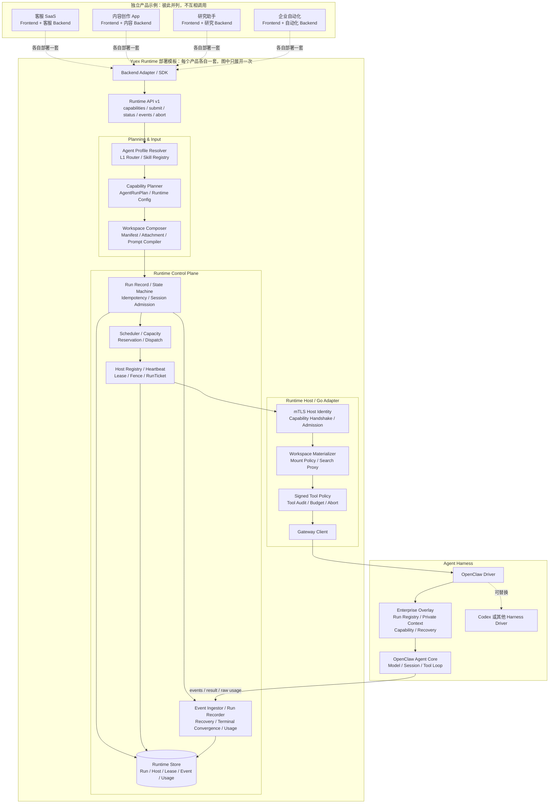

# Yuex Agent Runtime

[](LICENSE)

Yuex 是 Agent 产品的生产运行层。产品 Backend 先确认用户身份和权限，选择本次要使用的资料和 Agent，再把任务交给 Yuex；Yuex 负责这次任务（下文称为一个 `Run`）的排队、并发控制、执行记录和故障恢复。

负责执行模型、Session 和 Tool 循环的组件称为 Agent Harness。当前实现接入 [OpenClaw](https://github.com/openclaw/openclaw)。感谢 OpenClaw 社区提供开源的 Agent Loop、Session 和 Tool 基础。OpenClaw Core 不是本项目的原创代码；Yuex 实现的是它上方的生产控制层。通过实现新的 Harness Driver，也可以接入 Codex 或其他 Agent Harness。

> 本仓库是从现有工程复制的实现快照。核心机制来自实际运行代码，但部分 Go import、持久化和回调仍与原 Backend 相连。当前版本用于阅读代码和继续拆分，不是开箱即用的独立发行版。

## Architecture

下图同时表达两件事：上半部分列出可以采用 Yuex 的不同产品；下半部分展开一套 Yuex Runtime 的内部结构。

**虚线表示复用同一套代码和接口，不是网络请求。实线表示一个产品部署内部的实际调用。**



上面的四个产品是四种独立用法。实际部署客服 SaaS 时，客服 Backend 连接自己的 Yuex Runtime；部署内容创作服务时，内容 Backend 连接另一套 Yuex Runtime。下半部分只是把每套部署都相同的内部结构展开一次。

Runtime Store 也属于各自的 Yuex 部署，用来保存 Run、Host、Lease、Event 和 Usage。产品账号、会员、素材和正式资产仍在各自 Backend 中。

| 组件 | 保存和处理的内容 |
| --- | --- |
| 产品 Backend | 团队、用户、会员、价格、业务权限、产品中的对话、用户资料和最终作品 |
| Yuex Control Plane | 每次 Run 的状态、等待队列、执行机器归属、进度事件、故障恢复记录和原始用量 |
| OpenClaw、Codex 等 Harness | 模型消息、原生 Session、Tool 结果、上下文压缩记录和当前 Agent Loop |

Yuex 不保存会员和产品资产，但它不是无状态转发器。Run 状态和执行归属必须持久化，否则服务重启或执行机器失联后无法安全恢复。

## Example: Content Creation

本例中的用户 Alice 属于 Acme 团队。Backend 从登录态得到：

- `tenantId`：团队 ID，例如 `tenant_acme`。Backend 用它把 Acme 的用户和资料与其他团队分开。
- `userId`：用户 ID，例如 `user_alice`。Backend 用它检查 Alice 能读取哪些资料、能使用哪些功能。
- `workspaceId`：一组准备给 Agent 使用的资料 ID，例如 `workspace_acme_brand`。本例中包括品牌语气、产品笔记和图片；它不是服务器上的文件夹路径。
- `threadId`：产品页面中的一条对话或任务线，例如 `thread_launch_copy`。用户在同一条对话中继续提问时，`threadId` 保持不变。

### 1. Frontend Request

Alice 提交请求。`tenantId` 和 `userId` 来自服务端登录态，不由 Frontend 填写。

```http
POST /api/agent-runs
Content-Type: application/json
```

```json
{
  "workspaceId": "workspace_acme_brand",
  "threadId": "thread_launch_copy",
  "input": {
    "text": "把昨天上传的产品笔记改成一篇小红书文章，保持品牌语气"
  },
  "attachments": [
    {"resourceId": "resource_note_cover", "usage": "primary_input"}
  ]
}
```

这里的路由只是产品 API 示例，不是 Yuex 强制规定的路由。

### 2. Backend Preparation

Backend 按以下顺序准备 Run：

1. 检查 Alice 是否属于 Acme、是否能读取这份产品笔记，以及当前会员是否允许发起任务。这些是产品规则，Yuex 不重新判断。
2. 创建 `runId`（本次执行的唯一编号），例如 `run_20260902_001`。Frontend 用它查询进度和取消任务；Backend 与 Yuex 用它关联事件、结果和用量，并保证重复提交不会多执行一次。
3. 生成 `TaskIntent`（Backend 对用户请求的结构化分类）。本例使用 `content_creation`，表示“内容创作”这一类任务；这个名字由产品定义，用于筛选合适的 Agent 和 Skill，不是用户输入，也不是 Yuex 固定枚举。
4. 读取当前 Catalog（已经发布、当前可用的 Agent、Skill、知识、Tool 和模型配置清单）。本例选择 `content_writer` Agent Profile（内容写作 Agent 的配置包）和 `note_to_post` Skill（把笔记改写成社交媒体文章的操作说明）。
5. 选择本次需要的品牌写作知识、允许使用的 Tool、模型和输出格式，并写入 `AgentRunPlan`（本次 Run 最终采用的配置记录）。重试和恢复继续使用这份记录，不会临时换 Agent 或 Skill。
6. Workspace Adapter 读取 Backend 中已经授权的资料，生成 `RuntimeInputManifest`（本次 Run 可以读取的文件清单）。它把品牌语气映射为 `profile/brand-voice.md`，把产品笔记映射为 `materials/note-42.md`，把图片映射为 `input/attachments/01.png`。
7. 记录 `workspaceVersion`（这批资料的版本号）。用户在执行期间修改资料时，当前 Run 仍使用原版本，新内容从下一次 Run 开始生效。
8. 将 `threadId` 映射到 Harness Session Key（OpenClaw 或 Codex 内部使用的会话 ID）。这个映射只保存在服务端，Frontend 不会看到。`contextGeneration` 表示当前使用第几代会话上下文；切换 Workspace 或重建 Session 时递增。

Backend Adapter 随后提交以下数据。示例省略了签名和过期时间等传输字段。

```json
{
  "runId": "run_20260902_001",
  "taskIntent": {
    "category": "content_creation",
    "expectedOutput": "article"
  },
  "inputMessage": "把昨天上传的产品笔记改成一篇小红书文章，保持品牌语气",
  "inputManifest": {
    "tenantId": "tenant_acme",
    "userId": "user_alice",
    "workspaceId": "workspace_acme_brand",
    "workspaceVersion": 17,
    "contextGeneration": 3,
    "files": [
      {
        "logicalPath": "profile/brand-voice.md",
        "sourceType": "formal_workspace_ref",
        "sourceRef": "brand-profile-v17"
      },
      {
        "logicalPath": "materials/note-42.md",
        "sourceType": "formal_workspace_ref",
        "sourceRef": "note-42-v5"
      }
    ]
  },
  "plan": {
    "l1AgentProfile": "content_writer",
    "selectedSkillProfiles": ["note_to_post"],
    "selectedKnowledgeRefs": ["knowledge/content-writing/INDEX.md"],
    "requiredTools": ["read", "workspace_search"],
    "runtimeConfigId": "content-default",
    "outputContract": {"format": "markdown"}
  },
  "productSessionRef": {
    "threadId": "thread_launch_copy",
    "harnessSessionKey": "server-owned-session-key"
  }
}
```

数据库连接串、业务表名、Provider 明文密钥和服务器真实路径不会放进请求。Agent 只会拿到 Manifest 中列出的资料。

Runtime 接受任务后，Backend 把 `runId` 和当前状态返回给 Frontend：

```http
HTTP/1.1 202 Accepted
Content-Type: application/json
```

```json
{
  "runId": "run_20260902_001",
  "status": "queued"
}
```

### 3. Runtime Execution

Yuex 收到请求后完成以下处理：

1. Control Plane 检查 Runtime Host 的 `capabilities`（Host 报告的版本、可用 Tool、模型窗口和取消能力），确认它能执行这份 Plan。
2. 没有空闲容量时，Run 进入队列。有空位后创建 Reservation（短时间预留一个执行位置），避免多个请求同时占用同一个空位。
3. 分配 Runtime Host，并创建 Lease（记录当前由哪台 Host 执行以及这份所有权何时过期）和 Fence（每次重新分配都会增加的所有权编号）。旧 Host 即使延迟返回，也不能用旧 Fence 写入结果。
4. 生成 RunTicket（只对本次 Run 有效的短期授权），把 Run、团队、Workspace、Host、Plan、Manifest 和 Fence 绑定在一起。
5. Runtime Host 按 Manifest 创建 Run Workspace（本次 Run 专用的临时目录），只放入已经授权的 Agent 文件、Skill、知识、用户资料和附件。
6. OpenClaw Driver 将输入、Session 和 Run Workspace 交给 OpenClaw Agent Core。OpenClaw 执行模型和 Tool 循环，长对话超出模型窗口时按压缩规则继续。
7. Yuex 持续保存有顺序的事件，例如排队、开始执行、Tool 调用、草稿、完成或失败。Host 失联时，Recovery 根据保存的 Run、Lease 和事件记录接管任务。

### 4. Result

OpenClaw 返回最终文章和原始 Usage（模型 Token、Tool 调用和执行时间）。Yuex 保存唯一终态，Backend 校验输出后将文章写入自己的作品表，再按产品价格计算积分或账单。Yuex 不决定售价。

Frontend 只通过 Backend 使用 `runId` 查询、接收事件或取消：

```http
GET    /api/agent-runs/{runId}
GET    /api/agent-runs/{runId}/events?cursor={cursor}
DELETE /api/agent-runs/{runId}
```

完整链路如下：

```text
Frontend 提交产品请求
  → Backend 鉴权、选择 Agent、准备资料
  → Yuex 排队、分配 Host、建立执行所有权
  → Runtime Host 创建临时 Workspace
  → OpenClaw 执行模型和 Tool
  → Yuex 保存事件、结果和原始 Usage
  → Backend 写入产品数据并计费
  → Frontend 展示结果
```

Frontend 不直接连接 Yuex、Runtime Host 或 OpenClaw，也不持有 Harness Session Key、RunTicket、Lease、Fence、Provider Key 或真实文件路径。

## Workspace

Workspace 不是 Yuex 中长期维护的一份固定目录。长期资料仍在产品数据库、对象存储或已发布的 Agent 制品中。每次 Run 开始前，Backend 列出本次允许读取的资料，Runtime Host 再把这些资料组合成临时目录。

```text
已发布的 Agent / Skill 文件 ─┐
Backend 中的品牌资料和笔记 ─┼→ RuntimeInputManifest → Run Workspace → OpenClaw
对象存储中的图片和附件 ────┤
本次用户输入 ───────────────┘
```

Manifest 支持四种来源：

| `sourceType` | 实际内容 | 示例 |
| --- | --- | --- |
| `meta_release_ref` | 平台已经发布并带版本号的 Agent、Skill 或公共知识文件 | `AGENTS.md`、`skills/note_to_post/SKILL.md` |
| `formal_workspace_ref` | Backend 长期保存的团队或用户资料 | `profile/brand-voice.md`、`materials/note-42.md` |
| `object_ref` | 对象存储中的图片、文档等大文件，通过短期只读授权获取 | `input/attachments/01.png` |
| `inline` | 直接随本次请求发送的小段文本 | `input/user_request.md`、`input/context.md` |

本例最终创建的临时目录类似：

```text
run-workspace/
├── AGENTS.md                         # Agent 的工作规则
├── SOUL.md                           # 表达方式
├── TOOLS.md                          # Tool 使用说明
├── skills/
│   └── note_to_post/
│       ├── SKILL.md                  # 笔记改写方法
│       └── references/               # 该 Skill 的参考资料
├── knowledge/
│   └── content-writing/INDEX.md      # 本次选择的公共知识入口
├── profile/brand-voice.md            # Acme 的品牌语气
├── materials/note-42.md              # Alice 的产品笔记
├── input/
│   ├── user_request.md
│   └── attachments/01.png
├── staging/                           # 允许临时写入时使用
└── output/                            # 本次输出
```

`workspaceVersion` 固定的是本次使用的资料版本和文件清单，不是永久锁住一个目录。Run 执行期间新增或修改的资料只进入后续 Run。

Agent 如需修改产品中的正式资料，应返回结构化结果或 `assetWriteIntent`。Backend 重新检查权限和格式后写入数据库；Run Workspace 的临时 `write` 权限不能直接修改正式资产。

## Backend Integration

### Data Required for a Run

| Backend 准备的数据 | 用途 |
| --- | --- |
| 团队、用户和 Workspace ID | 确认本次任务属于谁，可以读取哪一组资料 |
| `runId` 和用户输入 | 标记本次执行，支持查询、取消、重试去重和结果关联 |
| `TaskIntent` | 用产品自己的任务分类选择合适的 Agent 和 Skill |
| `AgentRunPlan` | 固定本次 Agent、Skill、知识、Tool、模型和输出格式 |
| `RuntimeInputManifest` | 列出本次允许 Runtime 获取的文件及其版本 |
| `threadId`、Harness Session Key 和 `contextGeneration` | 将产品对话连接到 Harness 会话，并控制何时重建上下文 |
| 结果写回位置 | 告诉 Backend 最终结果应进入哪个 Thread、Task 或正式资产 |
| Usage 业务关联 | 将 Runtime 原始用量交给正确的产品账号结算 |

### Identifier Reference

| 字段 | 用途 | 示例 |
| --- | --- | --- |
| `tenantId` | 团队或公司 ID。Backend 用它隔开不同客户的数据，防止一个团队读到另一个团队的资料 | `tenant_acme` |
| `userId` | 当前用户 ID。Backend 用它检查成员身份、操作权限并记录是谁发起任务 | `user_alice` |
| `workspaceId` | 一组可供 Agent 使用的资料 ID，例如某个团队的品牌资料和项目文件 | `workspace_acme_brand` |
| `threadId` | 产品页面中的一条对话或任务线 ID | `thread_launch_copy` |
| `runId` | 一次执行的 ID，用于查进度、取消、重试去重以及关联事件、结果和用量 | `run_20260902_001` |
| Harness Session Key | `threadId` 在 OpenClaw 或 Codex 内部对应的会话 ID，只在服务端保存 | `openclaw:session:...` |
| `workspaceVersion` | 本次 Run 使用的资料版本；运行中的资料不会跟随用户修改而变化 | `17` |
| `contextGeneration` | 当前使用第几代会话上下文；换 Workspace 或重建 Session 时加一 | `3` |
| Catalog Revision | 本次 Run 使用的 Catalog 版本号，保证恢复时仍能找到相同配置 | `catalog_2026_09_02` |

单用户产品没有团队概念时，可以为整个产品使用一个固定 `tenantId`。`workspaceId` 是产品中的资料集合 ID，不要求对应本地目录。

`reservationId`、`fencingToken`、`capabilityHash` 和 `RunTicket` 由 Runtime 生成。Frontend 不填写，Backend 业务代码也不应手工拼接。

### Runtime API

| 操作 | 调用方 | 用途 |
| --- | --- | --- |
| `capabilities` | Control Plane / Adapter | 查询 Host 版本、可用 Tool、模型窗口、预算和取消能力 |
| `submit` | Backend / Dispatcher | 提交 Run；相同 `runId` 重复提交也只执行一次 |
| `status` | Backend / Recovery | 查询当前状态、最新事件序号、结果、错误和 Usage |
| `events` | Backend / Event Worker | 从指定 cursor 继续读取进度、Tool、草稿和终态事件 |
| `abort` | Backend | 取消 Run，并等待 Runtime 返回最终取消状态 |

Frontend 只调用产品 Backend。Backend 再调用以上 Runtime API，并把内部状态转换为产品自己的查询结果或 SSE 数据。

### Backend Adapters

| Adapter | 工作内容 |
| --- | --- |
| Identity | 从登录态得到团队、用户和 Workspace，检查产品权限 |
| Intent | 将页面操作或自由输入转换成 `TaskIntent` |
| Workspace | 将数据库记录、长期资料和附件转换成带版本的 Manifest |
| Session | 保存 `threadId` 与 Harness Session Key 的映射，维护 `contextGeneration` |
| Catalog / Entitlement | 返回产品允许用户看到的 Agent、Skill 和模型列表 |
| Runtime Client | 调用 `capabilities`、`submit`、`status`、`events` 和 `abort` |
| Event Projection | 将 Runtime 事件转换成产品查询接口或 SSE 数据 |
| Result Sink | 校验输出格式，把最终结果写回产品数据 |
| Usage | 接收原始 Usage，再按产品价格规则结算 |

Runtime Store 随 Yuex 部署，保存 Run、队列、Lease 和 Event。产品 Backend 不需要再建一套相同的执行状态。当前快照中仍与原 Backend 耦合的 Repository，后续应改为 Runtime 自有的存储接口和数据库迁移。

<details>
<summary>Codex 接入任务模板</summary>

```text
把 <YOUR_BACKEND> 接入 Yuex Agent Runtime。

先读取 README.md 和 Repository Layout 中的 Runtime、Adapter、Driver 代码。找出产品中的团队、用户、Workspace、Thread、Task、Result 和 Usage 分别存在哪里。

实现 Identity、Intent、Workspace、Session、Catalog、Event、Result 和 Usage Adapter。由 Backend 创建 runId 和 TaskIntent，固定 AgentRunPlan 与 RuntimeInputManifest，再接入 capabilities、submit、status、events 和 abort。Frontend 只能访问 Backend。

保留 workspaceVersion、contextGeneration、Reservation、Lease、Fence、RunTicket、重复提交去重、Event cursor 和唯一终态。不得向 Agent 暴露数据库凭据、Provider Key、Host 路径或内部 Session Store。原 Backend 专属 Repository 和 callback 应改成 Runtime 接口，不得把产品业务表复制进 Runtime Core。

验证重复 submit、SSE 断线续传、取消、Host 丢失恢复、旧 Fence 拒写和长上下文压缩。
```

</details>

## Agent Catalog

| 对象 | 内容 |
| --- | --- |
| Catalog | 当前已经发布并允许使用的 Agent、Skill、知识、Tool 和模型配置列表；每次发布都有版本号 |
| Agent Profile | 一个 Agent 的配置包，说明它负责什么任务、加载哪些规则、可以选择哪些 Skill、知识和 Tool |
| Skill | 完成一类任务的操作说明，包含输入要求、处理步骤、所需 Tool、输出格式和失败条件 |
| Knowledge Ref | 本次 Run 要加载的具体知识文件，而不是整个知识库 |
| Tool Policy | 本次 Run 允许和禁止使用哪些 Tool，以及能写到哪里 |
| Runtime Config | Provider、模型、Auth Pool、超时、Thinking、输出预算和 Plugin 配置 |
| Agent Release | 一次已经发布并带版本号的 Agent 文件与配置集合 |
| AgentRunPlan | 从 Catalog 中为某次 Run 选出的最终配置，Run 开始后不再改变 |

Agent Profile 有三种选择方式：用户从 Backend 返回的公开 Catalog 中选择；某个产品按钮固定使用指定 Profile；Backend 根据 `TaskIntent` 自动选择。无论入口是哪一种，最后都由服务端检查：

```text
TaskIntent + 用户权限 + Workspace + Catalog 版本
    → 找出支持该任务并允许当前产品使用的 Agent Profile
    → 从该 Profile 的候选 Skill 中选择满足任务和 Tool 条件的 Skill
    → 选择具体知识文件、Tool Policy、Runtime Config 和输出格式
    → 保存 AgentRunPlan
```

重试、恢复和最终结果解析继续使用同一个 Plan。Agent ID、Skill ID、知识路径和 Tool 名称只能来自 Catalog，模型不能临时创建。

### Skill Registry

Skill Registry 位于服务端 Runtime Meta/Catalog：

- Skill 正文发布在 `runtime-skills/<skillProfile>/SKILL.md`。
- Planning Catalog 记录 Skill ID、版本、支持的任务、允许的 Agent、需要的知识文件和 Runtime 能力。
- `meta-manifest.json` 列出 Runtime 可以加载的正式文件。
- Agent Profile 的 `candidateSkillProfiles` 只列候选 Skill；每次 Run 仍检查用户权限和 Host 能力。
- 用户 Workspace 可以保存个性化配置，但正式 Skill ID 和版本必须来自服务端 Catalog。

只有文件、没有进入 Registry 的 `SKILL.md` 不会被 Runtime 使用。

## Packages and Releases

Agent 设计源采用以下结构：

```text
agent-source/<agentProfile>/
├── AGENTS.md                  # 长期工作规则和任务边界
├── SOUL.md                    # 人格与表达方式
├── MEMORY.md                  # 稳定记忆规则
├── TOOLS.md                   # 已注册 Tool 的使用说明
├── capability-catalog.json    # 该 Agent 需要哪些 Runtime 能力
├── skills/                    # 任务方法
├── knowledge/                 # Agent 专属知识
└── protocols/                 # 输入、输出和写回格式
```

Provider 密钥和临时用户输入不进入 Agent 制品。`TOOLS.md` 只说明已注册 Tool 的用法，不实现 Tool，也不授予权限。

```text
设计源
  → 检查文件和能力声明
  → 生成 runtime-agents/<agentProfile>/
  → 生成 runtime-skills/<skillProfile>/
  → 登记 Knowledge Refs、Tool Policy 和 Runtime Config
  → 生成 agent-routing-manifest.json 与 meta-manifest.json
  → 生成带版本号且不可修改的 Release Bundle
  → 发布新的 Catalog 版本
```

已经开始的 Run 始终使用原 Release；新 Catalog 只影响新 Run。

| 扩展项 | 添加方式 |
| --- | --- |
| Agent Profile | 添加工作规则和能力声明，配置支持的任务、候选 Skill、知识目录、Tool Policy、Runtime Config 和输出格式，然后发布 Catalog |
| Skill | 添加 `runtime-skills/<skillProfile>/SKILL.md`，声明允许的 Agent、所需 Tool、知识文件和输出格式，再加入 Profile 候选列表 |
| Agent 专属知识 | 放在该 Agent 的 `knowledge/` 中，随 Agent Release 发布 |
| Skill 专属资料 | 放在 `runtime-skills/<skillProfile>/references/` 中，由该 Skill 按需读取 |
| 平台公共知识 | 放在 `knowledge/<domain>/` 中，通过小型 `INDEX.md` 或 `OVERVIEW.md` 被多个 Skill 引用 |
| 用户私有知识 | 保留在用户 Workspace 中，通过 `workspace_search` 找到路径，再用 `read` 读取 |
| 单次任务材料 | 通过 Manifest 放进 `input/`，Run 结束后不变成长期资料 |

`knowledgeRoots` 只规定 Agent 允许引用哪些知识目录。每次 Run 只加载 Plan 中明确选择的 `selectedKnowledgeRefs`，不会把整个知识库塞进上下文。

## Tools

当前企业契约向 Agent 提供 `read`、`workspace_search` 和按条件授权的 `write`。`workspace_search` 只返回已经授权的文件路径和基本信息，文件内容仍通过 `read` 获取。

新增 Tool 需要完成以下步骤：

1. 在 Agent Core、Harness Driver 或受控 Plugin 中实现 Tool 及输入/输出 Schema。
2. 通过 Runtime `capabilities` 报告 Tool 名称、Plugin 版本、Schema 和是否可以使用。
3. 在 Runtime Tool Catalog 和 Tool Policy 中注册。
4. 在 Agent `capability-catalog.json` 和需要该 Tool 的 Skill 中声明它。
5. Control Plane 根据 AgentRunPlan 生成本次 Run 的最小 Tool 权限；明确禁止的 Tool 始终不能调用。
6. Tool 执行时检查 Run、团队、Workspace、Lease 和 Fence，并记录开始、完成或拒绝事件。
7. 发布新的 Runtime/Plugin 和 Agent/Skill Release。只有报告该 Tool 可用的 Host 才会收到任务。

只修改 Prompt、`TOOLS.md` 或字符串允许列表，不代表 Tool 已经实现。

## Runtime

Control Plane 保存每次 Run 的内部状态：

```text
created
  → resolving_intent
  → planning
  → awaiting_confirmation?
  → admission_pending
  → queued
  → reserving
  → dispatched
  → accepted
  → materializing
  → running
  → finalizing
  → succeeded | failed | cancelled | timeout | orphaned
```

Backend 通常只向 Frontend 显示较少的产品状态：

```text
resolving → planning → awaiting_confirmation?
          → queued → running / aborting
          → succeeded | failed | cancelled | timeout
```

| 机制 | 处理的问题 |
| --- | --- |
| Admission | 确认 Backend 已经完成鉴权，并检查当前 Runtime 是否具备执行条件 |
| Scheduler / Capacity / Reservation | 按版本、Tool 和空闲位置选择 Host；没有容量时排队；提交前短暂保留空位 |
| Session Admission | 同一个 Harness Session 同时只运行一个会修改会话的 Run |
| Lease / Heartbeat / Fence | 记录当前执行者是否还在线，并阻止失去所有权的旧 Worker 写入 |
| RunTicket | 给单次 Run 签发短期授权，限制它只能使用指定团队、Workspace、Host、Plan 和 Manifest |
| Idempotency | 相同请求重复提交或网络重试时只执行一次、只写入一份结果 |
| Event Store | 给每个事件分配递增序号；SSE 断线后可以从上次 cursor 继续读取 |
| Capability Handshake | 调度前确认 Host 确实支持本次需要的版本、Tool、模型窗口和取消功能 |
| Tool Policy / Workspace Isolation | 只开放 Plan 需要的 Tool 和 Manifest 中的文件，阻止越权路径和文件逃逸 |
| Budget / Loop Guard | 限制重复 Tool 调用、搜索、写入、Token 和执行时间，避免无限循环 |
| Timeout / Abort | 区分用户取消、任务超时、Provider 失败和强制终止 |
| Recovery / Terminal Convergence | 从数据库中的 Run、Lease 和 Event 继续恢复，并确保结果、Usage 和资源释放各执行一次 |
| Output Contract | Run 开始前固定输出格式和解析版本，结束时不重新选择 Skill |
| Usage / Error Normalization | 返回原始用量和统一错误，不向 Frontend 泄露密钥或内部路径 |

### Sessions and Compression

| 内容 | 保存位置 | 保存多久 |
| --- | --- | --- |
| 用户长期资料 | 产品数据库、对象存储或 Formal Workspace | 由 Backend 长期管理 |
| 对话历史和压缩后的摘要 | Harness Session Store | 跟随 `threadId`，可以跨 Run 继续使用 |
| 当前请求、附件和临时输出 | Run Workspace | 只属于一次 Run |

Backend 维护 `threadId → Harness Session Key` 的服务端映射。`contextGeneration` 变化后，旧 Session 不再用于新的 Workspace 上下文。

长上下文压缩以即将发送给模型的完整 Prompt 为准，包括历史消息、旧摘要、Tool 结果、系统规则、Workspace 规则、Tool Schema、当前请求和图片。

```text
组装完整 Prompt，并按当前模型窗口预留输出空间
  ├── 没有超出窗口 → 发送
  └── 超出窗口
        ├── 将较早的对话和已经完成的 Tool 结果写成结构化摘要
        ├── 保留最近的原始消息，必要时只保留摘要
        ├── 重新组装并再次计算，直到放得下
        └── 当前请求、系统规则等不可删除内容仍然过大 → 明确返回失败
```

结构化摘要保留用户目标、限制条件、关键决定、已完成动作、Tool 证据、当前状态和待办事项。系统规则、当前请求和 Tool Schema 不会为了塞进模型窗口而被静默删除。压缩后仍会检查重复 Tool 调用和无进展循环。

Event Store 有另一套清理规则。Run 结束后可以删除早期 `draft_delta`，但必须保留最终状态和最终 Assistant 消息。事件清理与对话上下文压缩不是同一件事。

### Harness Drivers

Control Plane 只依赖 Driver 契约，不直接依赖 OpenClaw 私有数据结构。

| Driver 能力 | 必须实现的行为 |
| --- | --- |
| Submit | 接收已经确定的 Plan、Manifest、Session、Tool Policy 和输入，同一个 Run 只启动一次 |
| Status / Events | 将 Harness 的状态、进度、Tool、草稿和最终结果转换成 Yuex 事件 |
| Abort | 取消模型和 Tool 执行，并返回最终取消状态 |
| Capabilities | 报告版本、Tool Schema、模型窗口、预算和取消能力 |
| Session | 维护产品 `threadId` 与 Harness 原生 Session 的映射 |
| Workspace | 只访问本次 Run 创建的临时 Workspace |
| Context | 提供模型窗口计算、上下文压缩或同等能力 |
| Result / Usage | 返回统一格式的 Assistant 结果、错误类型和原始 Usage |

接入 Codex 或其他 Harness 时，产品账号、套餐、Thread、Workspace 和业务结果保持不变。新的 Driver 负责该 Harness 的启动、事件、取消、Session、Tool 和上下文处理。

## Repository Layout

| 目录 | 内容 |
| --- | --- |
| `extracted/go-runtime-control-plane/internal/runtime/` | Plan、Workspace 组合、Scheduler、Host、Capacity、Lease、Fence、Recovery、Event、Usage 和最终状态处理 |
| `extracted/go-runtime-adapter/cmd/openclaw-runtime-adapter/` | Go Runtime Host、HTTP Transport、Host 注册/心跳和 Gateway Bridge |
| `extracted/openclaw-driver/overlay/` | OpenClaw 企业 Run、策略、能力报告、事件和恢复扩展 |
| `extracted/openclaw-driver/tooling/` | Overlay 安装、契约生成和源检查工具 |
| `cut-boundary-reference/` | 原 Backend 的 API、Worker、Storage、Workspace Search 和部署接线参考；不属于独立 Runtime Core |

## License

本仓库原创代码按 [GNU Affero General Public License v3.0 only](LICENSE) 发布。OpenClaw 及其他第三方组件继续适用各自许可证，详见 [THIRD_PARTY_NOTICES.md](THIRD_PARTY_NOTICES.md)。
