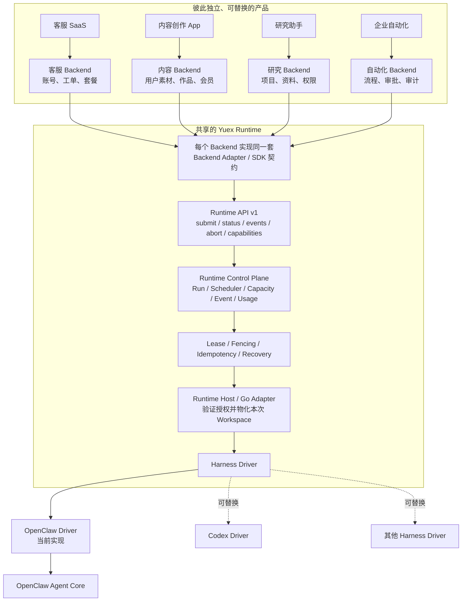

# Yuex Agent Runtime

[](LICENSE)

Yuex 是一个可复用的 Agent 生产运行层。不同产品保留自己的 Backend，把一次已经鉴权、已经选好 Agent、已经准备好上下文的任务交给 Yuex；Yuex 负责并发调度、执行安全、恢复、事件和 Harness 接入。

当前执行内核使用 [OpenClaw](https://github.com/openclaw/openclaw)。感谢 OpenClaw 社区提供优秀的开源 Agent Loop、会话和工具基础。OpenClaw Core 不是本项目的原创代码；Yuex 的工作主要位于它上方。通过替换 Harness Driver，同一控制面也可以接入 Codex 或其他优秀的 Agent Runtime。

> 当前仓库是从现有工程复制出的实现快照。核心机制是真实代码，但部分 Go import、持久化和回调仍与原 Backend 相连，因此这里首先是一份可继续独立化的实现基线，不是开箱即用的独立发行版。

## 先建立正确的心智模型

这里最容易混淆的是“Runtime 到底有没有状态”。答案是：**Yuex 不保存产品业务状态，但必须保存 Agent 执行状态。**

| 状态类型 | 谁负责 | 具体是什么 |
| --- | --- | --- |
| 产品业务状态 | 每个产品自己的 Backend | 账号、组织、会员、价格、余额、业务权限、产品 Thread、素材、正式资产和页面展示 |
| Runtime 执行状态 | Yuex Control Plane | Run 状态机、队列、容量、Reservation、Lease、Fencing、事件游标、恢复检查点和原始 Usage |
| Agent 上下文状态 | OpenClaw、Codex 等 Harness | 原生 Session、模型消息、工具结果、上下文压缩检查点和当前 Agent Loop |

Backend 负责租户、权限和计费，不是因为 Runtime 做不到，而是因为这些规则属于具体产品：客服 SaaS 和内容创作 App 对“用户”“套餐”“一次任务值多少钱”的定义完全不同。把它们放进 Runtime，Runtime 就不能被别的产品复用。

反过来，Runtime Control Plane 不能只是一个无状态 HTTP 转发器。没有持久化 Run 状态、Lease 和事件，它就无法判断哪个 Worker 仍然拥有任务，也无法在进程崩溃、网络重试或 Host 丢失后安全恢复。这些是**执行状态**，不是业务状态。

Runtime 记录模型 Token、工具调用和执行时间等原始 Usage；Backend 再根据自己的套餐、币种和价格规则，把 Usage 换算成积分或账单。Runtime 不决定售价。

## 总体架构

下图中的四个 Backend 是四个**彼此独立的产品示例**，不是同一个业务里的四个模块。你可以只接其中一个，也可以让多个产品共用同一套 Yuex Runtime。



每个产品只需要回答“这个人能不能做这件事、给 Agent 哪些资料、结果写回哪里”。Yuex 回答“这次执行交给谁、是否仍由它持有、事件是否连续、失败后怎样恢复”。Harness 回答“模型下一步说什么、调用哪个工具、上下文怎样继续”。

## 用一个具体请求走完整条链

假设我们接入一个“内容创作 App”。用户 Alice 在品牌团队 Acme 中，打开自己的内容工作区，要求：

> 把我昨天上传的产品笔记改成一篇小红书文章，保持品牌语气。

Backend 会依次完成：

1. 根据登录态确认 Alice 属于 Acme，并且能读取这份笔记。
2. 检查产品套餐是否允许发起本次任务；这是业务规则，不交给 Runtime 判断。
3. 创建一个 `runId`，把请求解释成 `content_creation` 类型的 `TaskIntent`。
4. 从当前 Catalog 选择 `content_writer` Agent Profile 和 `note_to_post` Skill。
5. 冻结本次要使用的 Agent 版本、Skill、知识、工具、模型配置和 Workspace 版本。
6. 把品牌资料、用户笔记、当前请求和 Agent 制品组合成 `RuntimeInputManifest`。
7. Yuex 排队、选择 Runtime Host、建立 Lease，然后物化一个隔离的 Run Workspace。
8. OpenClaw 读取该 Workspace，执行模型和工具循环，必要时压缩长上下文。
9. Yuex 持久化进度、工具审计、Usage 和唯一终态；Backend 把最终文章写进自己的作品表。
10. Backend 按自己的价格规则结算 Usage，并通过自己的 SSE/API 把结果展示给前端。

这条链里，OpenClaw 不需要知道 Acme 买了什么套餐，也不会直接连接 Backend 数据库。它只看到本次授权后的文件、工具和用户请求。

## 这些 ID 到底表示什么

ID 的作用是把同一次执行中的身份、数据和会话绑定在一起，并阻止跨用户、跨 Workspace 或旧任务串线。它们不是文件路径，也不是密钥。

| 字段 | 人能理解的含义 | 示例 | 谁创建 |
| --- | --- | --- | --- |
| `tenantId` | 数据与权限的最高隔离边界，通常是公司、团队或客户组织 | `tenant_acme` | Backend |
| `userId` | 发起操作的人或服务身份，用于权限和审计 | `user_alice` | Backend |
| `workspaceId` | 一组长期资料的逻辑容器，例如 Alice 的“内容大脑” | `workspace_alice_content` | Backend |
| `threadId` | 产品里的一个连续对话或任务线程 | `thread_launch_copy` | Backend |
| `runId` | 一次具体 Agent 执行；同一 Thread 可以有很多 Run | `run_20260902_001` | Backend/Control Plane |
| Harness Session Key | Thread 在 OpenClaw/Codex 内部对应的原生会话标识 | `openclaw:session:...` | 服务端 Session Adapter |
| `workspaceVersion` | 本次看到的是 Workspace 的哪个不可变版本 | `17` | Workspace Provider |
| `contextGeneration` | 当前 Thread/Workspace 上下文是哪一代，切换 Workspace 或重建会话时递增 | `3` | Backend/Session Adapter |
| Catalog Revision | 本次允许选择的 Agent、Skill、Tool 和配置集合版本 | `catalog_2026_09_02` | Agent 发布系统 |

单用户应用没有组织概念时，也可以使用一个固定 `tenantId`；它仍然提供明确的隔离边界。`workspaceId` 也不要求数据库里真的有一列本地目录，它只要能稳定定位一组资料并产生版本化快照即可。

`reservationId`、`fencingToken`、`capabilityHash` 和 `RunTicket` 是 Runtime 内部执行凭据，由 Control Plane 在调度时生成。前端不填写，业务开发者也不应该手工拼接。

## Workspace 是怎样动态组合的

在 Yuex 中，Workspace 最好理解为：**一次 Run 允许 Agent 看到的文件系统视图。**

Backend 保存的是业务对象，例如数据库中的用户画像、对象存储中的图片、文章记录和品牌资料。提交 Run 时，Workspace Adapter 把这些对象变成带版本的逻辑文件清单，而不是把数据库账号交给 Agent。

一个 Manifest 中的文件通常来自四类来源：

| 来源 | 用途 | 例子 |
| --- | --- | --- |
| `meta_release_ref` | 已发布的 Agent、Skill 和平台知识 | `AGENTS.md`、`skills/note_to_post/SKILL.md` |
| `formal_workspace_ref` | 用户长期 Workspace 中的已授权资料 | `profile/brand-voice.md`、`materials/note-42.md` |
| `object_ref` | 对象存储中的附件，通过短期只读能力获取 | `input/attachments/01.png` |
| `inline` | 体积小、只属于本次 Run 的文本 | `input/user_request.md`、`input/context.md` |

Runtime Host 验证 RunTicket 和 Manifest 后，才把它们物化成类似下面的目录：

```text
run-workspace/
├── AGENTS.md                         # Agent 的长期行为和边界
├── SOUL.md                           # 人格与表达姿态
├── TOOLS.md                          # 工具使用规则
├── MEMORY.md                         # 允许使用的稳定记忆规则
├── skills/
│   └── note_to_post/
│       ├── SKILL.md                  # 本次任务的方法和输出契约
│       └── references/               # 只属于该 Skill 的参考资料
├── knowledge/
│   └── content-writing/
│       └── INDEX.md                  # 本次明确选择的平台知识入口
├── profile/
│   └── brand-voice.md                # 用户 Workspace 的版本化资料
├── materials/
│   └── note-42.md
├── input/
│   ├── user_request.md
│   └── attachments/01.png
├── staging/                          # 有写权限时的受控临时区
└── output/                           # 本次 Run 的输出区
```

“固定 Workspace”不是永远锁死一个目录，而是在 Run 进入队列前固定：

- `workspaceId`、`workspaceVersion` 和 `contextGeneration`；
- 每个逻辑文件的来源、版本、大小和内容身份；
- 本次 Agent、Skill、Knowledge 和 Tool Policy Release；
- 本次附件、输入策略和 Runtime 能力版本。

因此用户即使在 Run 执行期间修改了笔记，也只影响下一次 Run；正在执行的 Run 不会前半段读旧内容、后半段突然读到新内容。

长期资料仍由 Backend 的 Workspace Service 写入。Agent 若想修改正式资产，应返回结构化结果或 `assetWriteIntent`，由 Backend 鉴权、校验、合并后写入；Runtime 的临时 `write` 权限不能直接改用户正式资料。

## Catalog、Agent Profile 和 Skill 分别是什么

| 名词 | 通俗解释 | 它决定什么 |
| --- | --- | --- |
| Catalog | 服务端发布的“可用能力菜单”，带一个不可变 Revision | 当前有哪些 Agent、Skill、Knowledge、Tool、模型配置可用 |
| Agent Profile | 一个版本化的 Agent 角色与能力边界，不只是名字 | 加载哪些行为文件、候选 Skill、知识根、工具策略和 Runtime Config |
| Skill | 完成一种任务的方法包 | 输入要求、读取顺序、判断方法、所需工具、输出格式和失败条件 |
| Knowledge Ref | 本次确实需要的知识文件入口 | 哪些知识可以进入 Run，而不是把整个知识库都塞进去 |
| Tool Policy | 该 Agent 在该 Run 中能调用哪些工具 | 最小权限 `allow`、明确 `deny` 和写入边界 |
| Runtime Config | 模型执行配置 | Provider、模型、Auth Pool、超时、Thinking、输出预算和 Plugin |
| Agent Release | 上述文件和声明的一次不可变发布 | 老 Run 可重放，新 Run 可切换到新版本 |
| AgentRunPlan | 一次 Run 的最终选择结果 | Agent、Skill、Knowledge、Tools、输出协议和所有版本 |

为什么一定要选择 Agent Profile？因为“内容创作”“客服处理”“研究分析”需要不同的系统规则、知识、工具和输出约束。若所有任务都塞给一个万能 Agent，权限会越来越大，提示词越来越长，结果也无法稳定发布和回滚。

### Example Backend 怎样选择

选择有三种入口，但最后都必须经过同一套服务端校验：

1. 用户显式选择：前端从公开 Catalog 选择“内容创作 Agent”。
2. 产品功能固定：用户点击“生成会议纪要”，Backend 直接产生对应 TaskIntent。
3. 意图路由：自由输入先被解析为 TaskIntent，再从服务端候选集合中选择。

实际选择流程是：

```text
用户请求 + 产品操作 + 已鉴权 Workspace
        ↓
TaskIntent
category / taskType / executionScope / expectedOutput / requiredCapabilities
        ↓
从当前 Catalog 过滤 Agent Profile
active + scope 匹配 + 任务匹配 + 产品权限/会员可用
        ↓
在该 Agent 的 candidateSkillProfiles 中过滤 Skill
active + task/intent 匹配 + Workspace 已授权 + 所需 Runtime Tool ready
        ↓
选择精确 Knowledge Refs、Tool Policy、Runtime Config 和 Output Contract
        ↓
冻结 AgentRunPlan；重试、恢复和终态解析都不再重新选择
```

以上面的内容产品为例，冻结后的核心事实大致是：

```json
{
  "l1AgentProfile": "content_writer",
  "selectedSkillProfiles": ["note_to_post"],
  "selectedKnowledgeRefs": ["knowledge/content-writing/INDEX.md"],
  "requiredTools": ["read", "workspace_search"],
  "runtimeConfigId": "content-default",
  "outputContract": {"format": "markdown"},
  "workspaceVersion": 17,
  "indexVersion": 17
}
```

这个 JSON 是概念示例，字段对应当前 `AgentRunPlan` 的核心结构。Agent ID、Skill ID、内部路径、模型密钥和任意工具名都不能由模型临时创造。

### Skill Registry 放在哪里

Skill Registry 属于服务端 Runtime Meta/Catalog，不属于前端，也不靠扫描用户目录生成。

- Skill 正文发布在 `runtime-skills/<skillProfile>/SKILL.md`。
- Skill 的状态、版本、任务类型、允许的 Agent、Knowledge Refs 和 Required Capabilities 进入生成后的 Planning Catalog。
- `meta-manifest.json` 登记可被 Runtime 装载的正式文件。
- Agent 的 `candidateSkillProfiles` 只声明候选集合，Planning 仍要再次校验权限和 Host 能力。
- 用户 Workspace 可以保存已安装或个性化的 Skill 实例，但 Skill 的官方身份仍必须来自服务端 Catalog。

存在文件但没有正式注册的 Skill 必须视为不可用，不能静默降级成通用聊天。

## Agent 制品怎样制作和发布

一个 Agent 的设计源可以采用下面的结构：

```text
agent-source/<agentProfile>/
├── AGENTS.md
├── SOUL.md
├── MEMORY.md
├── TOOLS.md
├── capability-catalog.json
├── skills/
├── knowledge/
└── protocols/
```

文件职责应保持稳定：

| 文件或目录 | 应该放什么 | 不应该放什么 |
| --- | --- | --- |
| `AGENTS.md` | 长期行为、任务边界、决策原则 | Provider 密钥、临时用户输入 |
| `SOUL.md` | 人格、价值取向、表达姿态 | 某一个任务的完整步骤 |
| `TOOLS.md` | 已注册工具的使用规则 | Tool 实现或凭空声明新工具 |
| `SKILL.md` | 一种任务的方法、输入、输出和失败规则 | 整个知识库正文 |
| `knowledge/` | Agent 独享的领域知识 | 用户私有资料 |
| `protocols/` | 稳定输入、输出和写回协议 | 运行日志和 Session 文件 |
| `capability-catalog.json` | Agent 声明需要的能力 | 绕过 Runtime Tool Catalog 的授权 |

发布链应当是：

```text
设计源
  → 校验文件边界和声明
  → 生成 runtime-agents/<agentProfile>/
  → 生成 runtime-skills/<skillProfile>/
  → 登记精确 Knowledge Refs
  → 生成 agent-routing-manifest.json 和 meta-manifest.json
  → 绑定 Tool Policy 与 Runtime Config
  → 产出不可变 Release Bundle
  → 提升 active Catalog Revision
```

旧 Run 始终引用旧 Release；只有新 Run 使用新 Catalog。这样更新 Prompt、Skill 或知识时，不会让正在执行的任务中途改变行为。

### 增加一个 Agent Profile

1. 为它选择稳定的 `agentProfile`，说明它服务的任务边界，而不是使用源码目录名。
2. 编写 `AGENTS.md`、`SOUL.md`、`TOOLS.md` 和必要的 Agent 专属知识。
3. 在路由清单声明 `intentCategories`、`taskTypes`、`executionScopes`、候选 Skill、知识根、Tool Policy 和优先级。
4. 绑定一个 Runtime Config 和明确的输入策略、输出协议。
5. 构建 Release，更新 Catalog；通过服务端目录后，前端才可以看见 `publicSelectable` 的 Profile。

### 增加一个 Skill 或知识

| 要增加什么 | 做法 |
| --- | --- |
| 新 Skill | 新建 `runtime-skills/<skillProfile>/SKILL.md`，声明任务、允许 Agent、所需能力、Knowledge Refs 和输出协议，再加入 Agent 候选集合并发布 |
| Agent 专属知识 | 放在该 Agent 的 `knowledge/`，只随它的 Release 发布 |
| Skill 专属参考 | 放在 `runtime-skills/<skillProfile>/references/`，由该 Skill 按需读取 |
| 平台通用知识 | 放在 `knowledge/<domain>/`，提供小型 `INDEX.md` 或 `OVERVIEW.md` 入口，由多个 Skill 以精确 Ref 引用 |
| 用户私有知识 | 留在用户 Formal Workspace，通过 `workspace_search` 找路径，再由 `read` 读取 |
| 单次任务材料 | 放进 Manifest 的 `input/`，Run 结束后不成为长期事实源 |

`knowledgeRoots` 只是允许引用的目录边界，不等于自动加载整棵树。每个 Run 只物化 Plan 中冻结的精确 `selectedKnowledgeRefs`，避免上下文膨胀和越权读取。

### 增加一个 Tool

当前企业契约只向 Agent 暴露 `read`、`workspace_search` 和条件授权的 `write`。其中 `workspace_search` 只返回已授权的逻辑路径和元数据，Agent 必须再用 `read` 读取内容。

新增 Tool 需要完成整条链，缺一层都不算可用：

1. 在 Agent Core、Harness Driver 或受控 Plugin 中实现 Tool 与输入/输出 Schema。
2. 在 Runtime `capabilities` 中发布 Tool 名称、来源、Plugin 版本、Schema 身份和 `ready` 状态。
3. 在 Runtime Tool Catalog 和 Tool Policy Profile 中登记它。
4. 在 Agent `capability-catalog.json` 中声明 Agent 可以使用它。
5. 在需要它的 Skill 中声明 Required Capability，Planning 才能写入 `requiredTools`。
6. Control Plane 根据 Plan 生成单次 Run 的最小权限、带签名 `tools.allow`；`deny` 永远优先。
7. Tool 执行时验证 Run、Tenant、Workspace、Lease/Fence，并记录 started、finished 或 rejected 审计事件。
8. 发布新的 Runtime/Plugin 和 Agent/Skill Release；只有能力握手通过的 Host 才能接收任务。

只修改 Prompt、`TOOLS.md` 或一个字符串 allow-list，不代表 Tool 已经实现。

## 前端、Backend 和 Runtime 怎样调用

### 前端只调用自己的 Backend

前端提交产品能理解的内容，不提交 Runtime 内部凭据。下面只是产品 API 的示例形状，每个 Backend 可以使用自己的路由和字段名：

```json
{
  "workspaceId": "workspace_alice_content",
  "threadId": "thread_launch_copy",
  "agentProfileId": "content_writer",
  "skillProfileIds": ["note_to_post"],
  "input": {
    "text": "把昨天的产品笔记改成一篇小红书文章"
  },
  "attachments": [
    {"resourceId": "resource_note_cover", "usage": "primary_input"}
  ]
}
```

`agentProfileId` 和 `skillProfileIds` 必须来自 Backend 返回的公开 Catalog。产品采用自动路由时，前端可以不传选择器，由 Backend 产生 TaskIntent。

前端收到 `runId` 后，通过 Backend 的查询或 SSE 查看公开状态、进度、草稿和终态。它不轮询 OpenClaw，不知道 Runtime Host 地址，也不持有真实 Workspace 路径、Provider Key、RunTicket、Lease 或 Fence。

### Backend 才调用 Runtime API

Backend/Adapter 完成鉴权、Planning、Workspace 冻结和容量预约后，内部提交大致是：

```json
{
  "runId": "run_20260902_001",
  "reservationId": "reservation_runtime_owned",
  "fencingToken": 8,
  "capabilityHash": "runtime-host-capability-identity",
  "inputMessage": "把昨天的产品笔记改成一篇小红书文章",
  "runtimeConfigId": "content-default",
  "runtimeConfigVersion": "v7",
  "inputManifest": {
    "tenantId": "tenant_acme",
    "userId": "user_alice",
    "workspaceId": "workspace_alice_content",
    "workspaceVersion": 17,
    "contextGeneration": 3,
    "files": [
      {
        "logicalPath": "materials/note-42.md",
        "sourceType": "formal_workspace_ref",
        "sourceRef": "versioned-workspace-object",
        "sizeBytes": 2048,
        "sha256": "sha256:<content-digest>"
      }
    ]
  },
  "plan": {
    "l1AgentProfile": "content_writer",
    "selectedSkillProfiles": ["note_to_post"],
    "selectedKnowledgeRefs": ["knowledge/content-writing/INDEX.md"],
    "requiredTools": ["read", "workspace_search"],
    "outputContract": {"format": "markdown"}
  },
  "productSessionRef": {
    "threadId": "thread_launch_copy",
    "openclawSessionKey": "server-owned-session-key"
  }
}
```

真实协议还会携带短期 RunTicket、精确 Manifest/Plan 身份、附件身份和过期时间。数据库连接、业务表名和 Provider 明文密钥都不在请求中。

Runtime API 的最小操作是：

| 操作 | 谁调用 | 用途 |
| --- | --- | --- |
| `capabilities` | Control Plane/Adapter | 确认 Host 版本、Tool、策略、预算和取消能力 |
| `submit` | Backend/Dispatcher | 幂等提交已经冻结且已经预约的 Run |
| `status` | Backend/Recovery | 对账当前状态、最新事件序号、结果、错误和 Usage |
| `events` | Backend/Event Worker | 按 sequence/cursor 增量消费进度、工具、草稿和终态事件 |
| `abort` | Backend | 把用户取消转换成 Runtime 取消，并等待唯一终态收敛 |

## Runtime 中有哪些生产机制

Runtime 保存的是下面这条**执行状态机**：

```text
created
  → resolving_intent
  → planning
  → awaiting_confirmation?
  → admission_pending
  → queued
  → reserving
  → dispatched
  → accepted
  → materializing
  → running
  → finalizing
  → succeeded | failed | cancelled | timeout | orphaned
```

前端不需要理解全部内部阶段。Backend 可以压缩成：

```text
resolving → planning → awaiting_confirmation?
          → queued → running / aborting
          → succeeded | failed | cancelled | timeout
```

完整的生产机制及其存在理由如下：

| 机制 | 解决的问题 |
| --- | --- |
| Admission | 接收 Backend 已完成的身份/套餐判断，再确认授权证明、Runtime 能力和执行条件；Runtime 不重新定义产品套餐 |
| Scheduler 与 Capacity Slot | 多个 Run 并发时，只分配给版本、能力、Scope 和空闲 Slot 都匹配的 Host；容量不足就排队，而不是随机失败 |
| Session Admission | 同一个产品 Session 的互斥执行，避免两个 Run 同时改写一条 Harness 会话 |
| Reservation | 在提交前短期保留 Host 容量，避免“选中时有空位、真正提交时已经超卖” |
| Lease 与 Heartbeat | 证明当前 Worker/Host 仍然活着；过期后 Recovery 才允许接管 |
| FencingToken | 每次接管都递增，旧 Worker 即使迟到也不能再写事件、结果或释放新 Owner 的资源 |
| RunTicket | 把 Run、Tenant、Workspace、Host、Reservation、Plan、Manifest 和 Fence 绑定成短期授权，阻止伪造与重放 |
| 幂等 | 重复 submit、网络重试和重复事件不会生成第二次执行或第二份业务结果 |
| 有序 Event Store | 每个事件有递增 sequence；SSE 断线后从 cursor 继续，过旧 cursor 返回明确 gap |
| Capability Handshake | 调度前确认 Host 真正实现了所需 Tool、Schema、预算、取消和版本，而不是相信静态配置 |
| Signed Tool Policy | 每次 Run 只开放 Plan 所需的最小工具集合，未知、重复、降级或签名不匹配都在模型调用前拒绝 |
| Workspace Isolation | 只物化 Manifest 中授权的逻辑路径，拒绝绝对路径、遍历、符号链接逃逸、超量文件和敏感内容 |
| Tool Budget 与循环保护 | 限制无进展重复调用、搜索/写入预算和墙钟时间，避免 Agent 无限循环或消耗失控 |
| Timeout 与 Abort | 区分用户取消、业务超时、Provider 失败和强制终止，并把它们收敛成可解释终态 |
| Recovery | Host 丢失、进程重启、事件中断后，从持久化 Run/Lease/Event 检查点继续，而不是从日志猜测 |
| Terminal Convergence | 确保最终 Assistant、业务投影、Usage 结算、Session/Slot 释放各执行一次，并可在中断后补齐 |
| Output Contract | Planning 时固定结果格式和解析身份；终态不能重新选择 Skill 或用随意 Markdown 冒充结构化成功 |
| Usage Metering | 汇总模型、Tool 和执行资源的原始用量，交给 Backend 的计费规则消费 |
| Error Normalization | 把不同 Provider/Harness 错误转换成稳定、安全的 Runtime 错误，不向前端泄露密钥和内部路径 |

这些机制共同解决的不是“模型够不够聪明”，而是“上百个任务同时运行、重试和故障时，系统还能不能知道谁在执行、执行到哪、结果是否只写了一次”。

## Session、记忆和长上下文压缩

三种上下文不要混在一起：

| 内容 | 放在哪里 | 生命周期 |
| --- | --- | --- |
| 用户长期事实和业务资料 | Formal Workspace / Backend 数据库 | 长期存在，由 Backend 管理 |
| 对话历史和压缩检查点 | Harness Session Store | 跟随 Thread，可跨 Run 继续 |
| 当前请求、附件和临时输出 | Run Workspace | 只属于一次 Run |

Backend 维护 `threadId → Harness Session Key` 的服务端映射。`contextGeneration` 改变时，旧 Session 不能继续污染新的 Workspace 上下文。

长上下文压缩不是简单删除旧消息。Runtime/Harness 以即将发送给当前 Provider 的**完整 Prompt**作为压力事实，其中包括历史、旧摘要、工具结果、系统与 Workspace 规则、Tool Schema、当前请求、图像和 Provider 包装。

```text
组装完整 Provider Prompt
        ↓
按当前模型窗口和输出预留量测量压力
        ├── 未超预算 → 允许发送
        └── 超预算
              ├── 有可压缩历史
              │     → 将旧历史和已完成工具证据写成结构化检查点
              │     → 保留近期原文尾部；必要时进入 summary-only
              │     → 重新组装完整 Prompt 并重新测量
              │     → 只要压缩边界还能推进，就继续收敛
              └── 当前请求、系统规则、Tool Schema 等不可压缩部分已超预算
                    → 明确失败，不静默删除安全规则或用户当前请求
```

结构化检查点至少保留：用户目标、约束、关键决策、已完成动作、工具证据、当前状态、未完成请求和下一步。压缩成功的条件不是“生成过摘要”，而是重组后的完整 Prompt 已经进入当前模型预算。

压缩后仍保留工具循环保护：若 Agent 在压缩后继续重复同一调用、来回 ping-pong 或没有进展，Runtime 可以中止异常循环，但不会用固定的低调用次数替代正常推理。

Event Store 还有独立的保留压缩：Run 终态后可以清理旧 `draft_delta` 前缀，但必须保留终态和最终 Assistant；这是事件存储治理，不是 Agent 上下文压缩。

## 为什么可以替换 OpenClaw

Control Plane 只依赖稳定的 Driver 契约，不应该依赖 OpenClaw 私有 DTO。一个 Codex Driver 或其他 Harness Driver 至少要实现：

| Driver 能力 | 必须保持的语义 |
| --- | --- |
| Submit | 接收冻结 Plan、Manifest、Session、Tool Policy 和输入，幂等启动一次执行 |
| Status / Events | 把 Harness 原生状态、进度、Tool、草稿和终态归一化为有序 Runtime Event |
| Abort | 取消当前模型和工具执行，并最终回报唯一终态 |
| Capabilities | 报告版本、Tool Schema、上下文、预算和取消能力，供 Scheduler 匹配 |
| Session | 维护产品 Thread 与 Harness 原生 Session 的稳定关系 |
| Workspace | 只访问物化后的 Run Workspace，不越过 Manifest 和 Tool Policy |
| Context | 提供窗口测量、压缩或等价的长上下文连续执行能力 |
| Result / Usage | 返回标准 Assistant 结果、错误分类和原始 Usage |

因此替换 Harness 时，产品的账号、套餐、Thread、Workspace 和业务结果不需要重写；变化集中在 Driver、Runtime Config 以及该 Harness 的 Tool/Session 适配。

## 接入一个新 Backend 时真正要做什么

| 你需要实现 | 具体工作 |
| --- | --- |
| 身份映射 | 从产品登录态解析稳定的 Tenant、User 和 Workspace，并做业务权限检查 |
| Intent 映射 | 把按钮、页面操作或自由输入转换成 TaskIntent，或校验用户从公开 Catalog 选择的 Profile |
| Workspace Adapter | 把数据库对象、正式 Workspace 和对象存储附件转换成版本化逻辑文件与 Manifest |
| Session Adapter | 保存 Thread 到 Harness Session Key 的映射，并维护 context generation |
| Catalog/Entitlement Adapter | 暴露当前公开 Agent/Skill/Model 目录，并叠加产品会员与授权规则 |
| Runtime Client | 调用 capabilities、submit、status、events 和 abort；保存自己的业务关联 |
| Event Projection | 把 Runtime 事件转换为产品 SSE、任务页或聊天消息所需的公开模型 |
| Result Sink | 校验 Output Contract，把唯一终态写回产品 Thread、Task 或正式资产 |
| Usage Adapter | 接收原始 Usage，再由产品自己的套餐和价格规则结算 |

| 你应该复用 Yuex | 不要在新 Backend 里重写 |
| --- | --- |
| Run 状态机与 Event Store | 不要再造第二套互相竞争的执行状态 |
| Scheduler、Capacity、Reservation | 不要让业务 Worker 直接随机选择 Harness 进程 |
| Lease、Fence、幂等和 Recovery | 不要用“进程还在”或日志文本判断所有权 |
| RunTicket、Manifest 和 Tool Policy | 不要让前端或模型直接决定内部权限 |
| OpenClaw Driver | 使用 OpenClaw 时直接复用；换 Harness 时实现新的 Driver |

Runtime Store 是 Yuex 部署的一部分，不是要求每个产品 Backend 自己设计一套 Lease 表。当前快照中这些 Repository 仍与原 Backend 耦合，独立化时应把它们收进 Runtime 自己的存储端口和迁移，而不是复制进每个新产品。

### 可直接交给 Codex 的接入任务

```text
目标：把 <YOUR_BACKEND> 接入 Yuex Agent Runtime，保留该产品自己的业务所有权。

先阅读：
- README.md
- extracted/go-runtime-control-plane/internal/runtime/
- extracted/go-runtime-adapter/cmd/openclaw-runtime-adapter/
- extracted/openclaw-driver/overlay/
- cut-boundary-reference/ 中的 API、Worker、Storage 和 Workspace Search 参考

第一步只输出映射，不改代码：
1. 找出登录身份、组织/租户、用户、Workspace、Thread、业务 Task、结果和 Usage 的真实数据所有者。
2. 说明哪些是产品业务状态，哪些应交给 Yuex Runtime Store，哪些属于 Harness Session。
3. 用一个真实产品请求画出 Frontend → Backend → Yuex → Harness → Backend 的字段流。
4. 列出当前 Backend 中可直接复用的接口，以及需要新增的 Adapter 边界。

确认映射后实施：
1. 实现 Identity、Intent、Workspace、Session、Catalog、Event、Result 和 Usage Adapter。
2. 由服务端创建 TaskIntent，选择并冻结 AgentRunPlan 和 RuntimeInputManifest。
3. 接入 capabilities / submit / status / events / abort；前端不能直接访问 Runtime。
4. 保留 Workspace version、context generation、Reservation、Lease、Fencing、RunTicket、幂等和 cursor 语义。
5. 将 Runtime Event 投影为 Backend 的 SSE/查询模型，将唯一终态写回产品数据。
6. 不把数据库凭据、Provider Key、真实 Host 路径或内部 Session Store 暴露给 Agent。
7. 遇到原 Backend 专属 import、Repository 或 callback 时，抽成 Runtime port/interface；不要把原产品业务表复制进 Runtime Core。

交付物：
- 业务状态 / Runtime 状态 / Harness 状态所有权表
- Backend 到 Runtime 的字段映射
- Adapter 接口与实现
- Runtime Store 所需迁移和配置
- Agent/Skill/Catalog 示例制品
- 本地启动方式
- submit 幂等、SSE 续传、取消、Host 丢失恢复、旧 Fence 拒写和长上下文 focused tests
```

## 从哪里读代码

| 目录 | 内容 |
| --- | --- |
| `extracted/go-runtime-control-plane/internal/runtime/` | Plan、Workspace Composer、Scheduler、Host、Capacity、Lease、Fence、Recovery、Event、Usage 和终态收敛 |
| `extracted/go-runtime-adapter/cmd/openclaw-runtime-adapter/` | Go Runtime Host、HTTP Transport、Host 注册/心跳和 Gateway Bridge |
| `extracted/openclaw-driver/overlay/` | OpenClaw 企业 Run、策略、能力握手、事件和恢复扩展 |
| `extracted/openclaw-driver/tooling/` | Overlay 安装、契约生成和源检查工具 |
| `cut-boundary-reference/` | 原 Backend 的 API、Worker、Storage、Workspace Search 和部署接线参考；它们不是独立 Runtime Core |

## License

本仓库中原创代码按 [GNU Affero General Public License v3.0 only](LICENSE) 发布。OpenClaw 及其他第三方组件继续适用各自许可证，详见 [THIRD_PARTY_NOTICES.md](THIRD_PARTY_NOTICES.md)。

