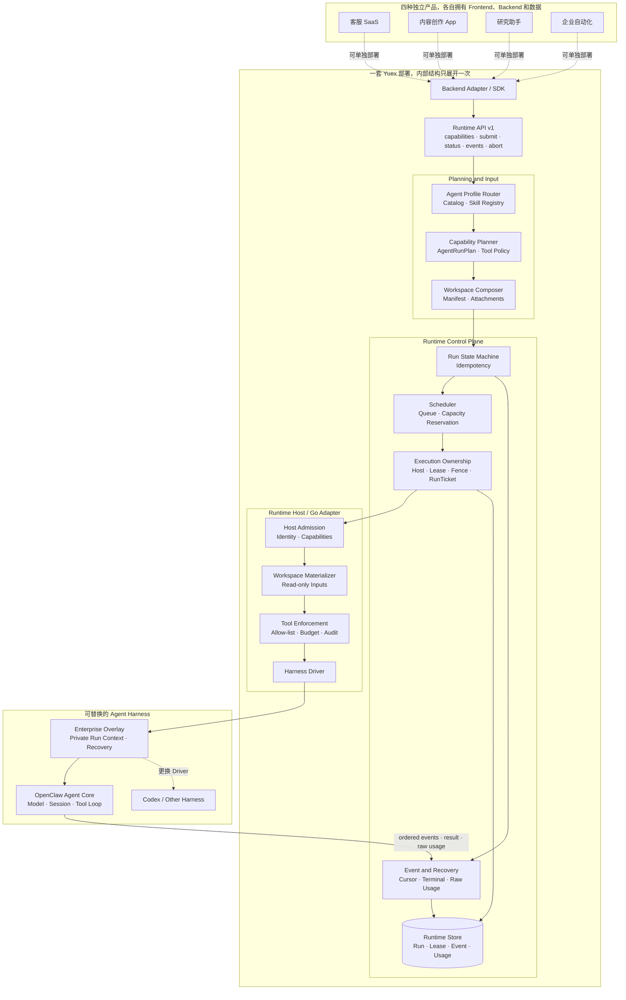
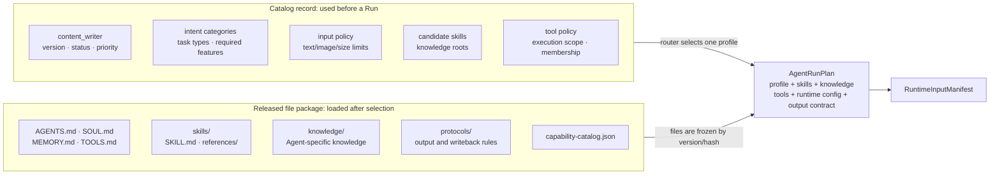
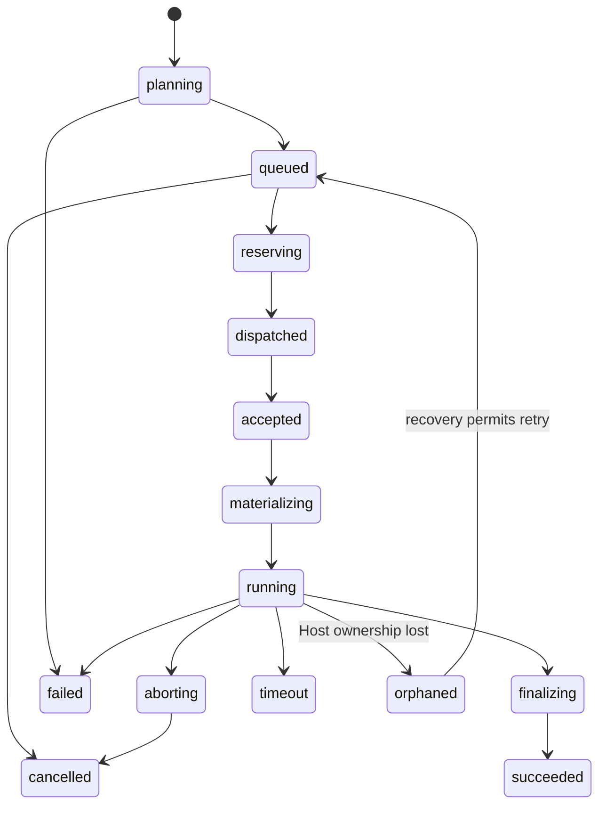

# Yuex Agent Runtime

[](LICENSE)

Yuex 是放在产品 Backend 与 Agent Harness 之间的生产运行层。Backend 决定“谁可以发起任务、允许读取什么、最后写到哪里、如何计费”；Yuex 决定“一次 Agent 执行如何排队、由哪台机器执行、发生故障后怎样接管、事件和原始用量怎样留痕”。

当前 Driver 接入 [OpenClaw](https://github.com/openclaw/openclaw)。感谢 OpenClaw 社区提供开源的 Agent Loop、Session 与 Tool 基础。OpenClaw Agent Core 不是本项目的原创代码；本仓库实现的是它上方的并发控制、Workspace 装配、执行所有权和恢复机制。Driver 是边界，后续也可以替换为 Codex 或其他优秀的 Agent Harness。

> 本仓库是从实际工程中复制出来的 Runtime 快照。部分 Go import、持久化接口和回调仍保留原系统边界，因此它目前适合阅读、拆分和二次集成，不是下载后即可独立启动的发行包。

## Architecture

客服、内容创作、研究助手和企业自动化是四个彼此独立的产品示例。它们可以分别复用这套 Runtime 代码和 API，并不表示四个产品必须连接同一个在线实例。图中的虚线表示“可以采用这套代码”，实线才表示一次部署内的真实调用。



每个产品部署自己的 Backend 和数据库，也可以部署自己的 Yuex 实例。Yuex 的 Runtime Store 不是产品数据库：它保存 Run、队列、Lease、Fence、事件和原始 Usage，以便并发调度与故障恢复；产品中的团队、会员、会话、作品、价格和积分仍由 Backend 保存。

| 产品 Backend 负责 | Yuex 负责 | Harness 负责 |
| --- | --- | --- |
| 登录、租户与用户、数据权限、Thread 和 Message、正式资产、价格、会员、积分与账单 | Run 状态机、并发容量、调度、Host 所有权、Lease/Fence、事件、恢复、原始 Usage | 模型调用、Harness Session、Tool 循环、上下文窗口与压缩 |

## Example

下面用内容创作产品走完一次真实调用。这里的路由和名称只是示例，不是 Yuex 强制的产品 API。

### 1. Frontend sends a message

Alice 在品牌 Workspace 的对话里发送一条消息：

```http
POST /api/v1/agent/runs
Content-Type: application/json
Authorization: Bearer <product-session>
Idempotency-Key: create-post-20260903-001
```

```json
{
  "workspaceId": "workspace_acme_brand",
  "threadId": "thread_launch_copy",
  "input": {
    "type": "text",
    "text": "把昨天上传的产品笔记改成一篇小红书文章，保持品牌语气。"
  },
  "attachments": [
    {"resourceId": "resource_cover", "usage": "primary_input"}
  ]
}
```

`workspaceId` 是一组长期资料的业务编号，本例中代表 Acme 团队的品牌语气、产品笔记和已授权素材；它不是服务器路径。`threadId` 是产品里的一条对话，同一条对话继续提问时保持不变。`tenantId`（团队编号）和 `userId`（Alice 的用户编号）必须由 Backend 从登录态取得，不能相信浏览器提交的同名字段。

### 2. Backend creates one Run

Backend 依次完成这些工作：

1. 确认 Alice 属于 Acme，能够使用这个 Workspace、Thread 和附件，也有当前会员等级所需的功能与余额。
2. 先保存 Alice 的 Message，再创建一个 `runId`，例如 `run_20260903_001`。`runId` 是这一次执行的唯一编号；查询进度、断线续传事件、取消、结果回写和 Usage 都用它关联。相同 `Idempotency-Key` 重试只能得到同一个 Run。
3. 冻结当前 `workspaceVersion`。如果 Alice 在运行中又改了品牌资料，本次 Run 仍读旧版本，新资料从下一次 Run 生效。
4. 根据当前输入和已发布 Catalog 选择 Agent Profile 与 Skills，形成不可变的 `AgentRunPlan`。重试时继续用同一份 Plan，不能临时换 Agent、Tool 或模型。
5. 把获准读取的 Agent 文件、Skill、知识、品牌资料、用户输入和附件列入 `RuntimeInputManifest`。Manifest 是文件白名单，不包含数据库连接串、Provider Key 或真实存储路径。
6. 把产品 `threadId` 映射为服务端持有的 Harness Session Key。`contextGeneration` 表示这条对话当前使用第几代上下文；切换 Workspace 或重建 Session 时递增。浏览器和模型都看不到 Session Key。
7. 在提交 Runtime 前预留额度，避免多个并发请求同时花掉同一份余额。

Backend 交给 Yuex 的核心数据大致如下：

```json
{
  "runId": "run_20260903_001",
  "owner": {
    "tenantId": "tenant_acme",
    "userId": "user_alice",
    "workspaceId": "workspace_acme_brand",
    "workspaceVersion": 17
  },
  "session": {
    "threadId": "thread_launch_copy",
    "harnessSessionKey": "server-owned-encrypted-reference",
    "contextGeneration": 3
  },
  "taskIntent": {
    "category": "content_creation",
    "expectedOutput": "article"
  },
  "plan": {
    "agentProfile": "content_writer",
    "skills": ["note_to_post"],
    "knowledge": ["knowledge/content-writing/INDEX.md"],
    "tools": ["read", "workspace_search"],
    "runtimeConfig": "content-default",
    "outputContract": "article.v1"
  },
  "inputManifest": {
    "files": [
      {"logicalPath": "profile/brand-voice.md", "sourceType": "formal_workspace_ref", "sourceRef": "brand-profile-v17"},
      {"logicalPath": "materials/note-42.md", "sourceType": "formal_workspace_ref", "sourceRef": "note-42-v5"},
      {"logicalPath": "input/attachments/01.png", "sourceType": "object_ref", "sourceRef": "resource_cover"},
      {"logicalPath": "input/user_request.md", "sourceType": "inline", "content": "把昨天上传的产品笔记改成一篇小红书文章，保持品牌语气。"}
    ]
  }
}
```

Backend 不需要把数据库交给 Agent。它只需从数据库和对象存储中取出已经鉴权的内容，再以 Manifest 引用或短期只读引用交给 Runtime。

### 3. Yuex executes it

Yuex 先确认有能力执行这份 Plan 的 Runtime Host，再等待并发容量。分配成功后，它为本次 Run 建立短期 Lease 和递增的 Fence。Lease 表示“现在由哪台 Host 执行”；Fence 是所有权代数，任务被重新分配后，旧 Host 即使迟到也不能用旧 Fence 写入事件或结果。

Runtime Host 校验只对这次 Run 有效的 RunTicket，按 Manifest 创建临时 Workspace，随后 Driver 把 Workspace、用户输入和 Session 交给 OpenClaw。OpenClaw 运行模型与 Tool 循环，Yuex 按顺序保存事件。Host 失联时，Recovery 根据持久化的 Run、Lease、Fence 和事件游标判断接管、重试或终止，而不是仅靠进程内存猜测。

### 4. Backend returns the result

Runtime 最终返回结果和原始 Usage，例如输入/输出 Token、Tool 次数与执行时间。Backend 校验输出合同后，把 Assistant Message 和正式作品写回自己的数据库，再用产品自己的价格、会员和积分规则结算。Runtime 提供计量事实，不决定售价。

Frontend 只调用 Backend：

```http
GET  /api/v1/agent/runs/run_20260903_001
GET  /api/v1/agent/runs/run_20260903_001/events?cursor=42
POST /api/v1/agent/runs/run_20260903_001/cancel
```

`cursor` 是客户端已经收到的最后一条事件位置。断线重连时带上它，Backend 只返回后续事件。取消接口先持久化取消意图，再由 Worker 带当前 Fence 调用 Runtime abort，不能从浏览器直接杀 Host 进程。

完整链路是：

```text
Frontend message
  -> Backend auth + Message + idempotent Run + credit reservation
  -> Agent Profile / Skill selection + frozen Plan + input Manifest
  -> Yuex queue + capacity + Host Lease/Fence
  -> temporary Run Workspace
  -> OpenClaw model/session/tool loop
  -> ordered Runtime events + terminal result + raw Usage
  -> Backend assistant Message + product asset + billing settlement
  -> Frontend status/events/result
```

可直接阅读 [`examples/backend/`](examples/backend/) 中的精简 Backend Example。它展示上述调用顺序，但故意不是可编译的完整服务。

## Agent Profile

Agent Profile 不是一个正在运行的进程，而是一份已发布的 Agent 配置。Catalog 用它判断“什么任务可以选这个 Agent”；文件包则告诉 Harness“选中后具体按什么规则工作”。

下面的 `content_writer` 仅用于解释结构，**不是声明本仓库已经内置或发布了这个 Profile**。



一个精简的 Catalog 记录可以长这样：

```json
{
  "agentProfile": "content_writer",
  "displayName": "Content Writer",
  "status": "active",
  "version": "1.4.0",
  "publicSelectable": true,
  "intentCategories": ["content_creation", "rewrite"],
  "taskTypes": ["article", "social_post"],
  "candidateSkillProfiles": ["note_to_post", "long_form_article"],
  "knowledgeRoots": ["knowledge/content-writing"],
  "toolPolicyProfile": "content-readonly",
  "requiredFeatures": ["workspace_search"],
  "executionScopes": ["product_thread"],
  "inputPolicy": {
    "acceptsText": true,
    "acceptedImageMIMETypes": ["image/png", "image/jpeg"],
    "maxFiles": 8,
    "maxBytes": 20971520
  }
}
```

对应的发布包通常是：

```text
agent-source/content_writer/
├── AGENTS.md                    # 长期工作规则和边界
├── SOUL.md                      # 语气、立场和默认表达方式
├── MEMORY.md                    # 允许进入常驻上下文的记忆规则
├── TOOLS.md                     # Tool 使用说明
├── capability-catalog.json      # Profile 能力与可选 Skill 声明
├── skills/
│   ├── note_to_post/
│   │   ├── SKILL.md             # 笔记改写的步骤和检查项
│   │   └── references/          # 仅该 Skill 使用的参考资料
│   └── long_form_article/
│       └── SKILL.md
├── knowledge/
│   └── content-writing/         # 该 Agent 可引用的通用写作知识
└── protocols/
    └── article-output.md        # article.v1 输出与写回合同
```

发布时为 Catalog 记录和文件包生成不可变版本。一次 Run 只从当前生效 Catalog 中选一个 Agent Profile，再从它允许的候选集合中选本次需要的 Skill；没有被选中的 Skill 不进入 Run Workspace。Agent 专属知识放在该 Agent 包的 `knowledge/`，Skill 独享资料放在 `skills/<skill>/references/`，多个 Agent 共用的知识应作为单独的版本化知识包发布。Tool 先在 Host 实现，再登记能力，最后加入 Tool Policy allow-list；只写进提示词并不会让 Tool 变得可用。

## Workspace

这里有两个不同的 Workspace，不能混为一个目录。

**Formal Workspace** 是 Backend 长期保存的用户/团队工作区。它包含用户资产和对 Agent 文件的合法定制，是事实源。**Run Workspace** 是 Runtime Host 为一次 Run 临时生成的执行目录，只包含本次获准读取的快照，任务结束后可清理。Harness 的 Session Store、Runtime 日志和数据库都不在这两个目录里。

OpenClaw 对 Workspace 的基础说明见 [Agent Workspace](https://docs.openclaw.ai/concepts/agent-workspace)。Codex 对目录中的分层指令文件如何生效有相近说明，见 [AGENTS.md](https://developers.openai.com/codex/guides/agents-md/)。Yuex 在这些文件约定之外增加了版本冻结、Manifest 白名单和单次 Run 隔离。

### Formal Workspace: L0-L5

L0-L5 是六类内容职责，不要求每层恰好对应一个名为 `L0` 的目录。不同产品可以增加 `book/`、`projects/` 或 `work/`，但每个文件仍应有明确归属。

| 层 | 放什么 | 常见路径 | 谁能改 |
| --- | --- | --- | --- |
| L0 协议边界 | Agent 的安全规则、身份、用户说明、Tool 边界和协议 | `AGENTS.md`, `SOUL.md`, `USER.md`, `TOOLS.md`, `MEMORY.md`, `protocols/` | 平台发布默认值；用户只在允许区域定制 |
| L1 原始材料 | 用户上传或沉淀的事实材料，不把推断当事实 | `materials/`, `uploads/`, `assets/`, `notes/` | 用户或 Backend 的资产服务 |
| L2 Profile 事实 | 人、团队、品牌、产品的可核验事实与事件 | `profile/facts/`, `profile/events/`, `profile/products/` | 用户或经过校验的写回流程 |
| L3 偏好与定位 | 语气、偏好、禁区、受众和定位结论 | `profile/preference-boundaries.md`, `profile/user-positioning/` | 用户为主，Agent 可提交待确认建议 |
| L4 创作现场 | 正在进行的文章、项目、工作稿和日常产出 | `内容.md`, `daily-assets/`, `book/`, `projects/`, `work/` | 用户以及获得写回授权的 Backend 流程 |
| L5 派生导航 | 指向 L1-L4 的短索引，帮助 Agent 找文件 | `resources/overview.md`, `resources/materials.md`, `resources/profile.md` | Index/Projector 自动生成 |

例如，一个内容产品的 Formal Workspace 可以是：

```text
workspace_acme_brand/
├── AGENTS.md                         # L0
├── SOUL.md                           # L0
├── USER.md                           # L0
├── TOOLS.md                          # L0
├── MEMORY.md                         # L0
├── protocols/                        # L0
├── materials/                        # L1: 笔记、访谈、转写
├── assets/                           # L1: 图片、文档引用
├── profile/
│   ├── facts/                        # L2: 品牌与产品事实
│   ├── events/                       # L2: 已发生事件
│   ├── preference-boundaries.md      # L3: 表达偏好与禁区
│   └── user-positioning/             # L3: 受众和定位
├── 内容.md                           # L4: 当前内容入口
├── daily-assets/                     # L4: 日常创作
├── projects/                         # L4: 项目稿件
├── skills/                           # 用户启用或定制的 Skill 文件
└── resources/                        # L5: 自动生成的扁平导航
    ├── overview.md
    ├── materials.md
    ├── profile.md
    └── creative.md
```

L5 不是第二份资料库。它只列出路径并指向真正的源文件，`resources/**` 自身不会再次进入索引成为“新事实”。修改 L1-L4 后由 Index/Projector 重建 L5；直接改导航文件不能冒充修改原资料。

### How the files are combined

正式 Workspace 的默认 Agent 文件可以从平台版本升级，但升级不是简单覆盖用户文件：平台安全边界和输出协议以新版本为准；用户在允许区域写入的偏好和说明要保留；双方改到同一受保护区域时应进入人工处理，而不是静默选择一方。

创建 Run 时，Composer 再按以下顺序编译本次文件：

```text
1. selected Agent release files
2. selected Skill release files
3. authorized Formal Workspace overrides for those same Agent/Skill paths
4. allowed Workspace protocols and only the Skills frozen in the Plan
5. selected versioned knowledge
6. inline request/context/plan
7. authorized materials and attachments
```

Formal Workspace 只能覆盖已经授权的 Agent/Skill 逻辑路径，不能借同名文件注入未选中的 Skill。额外协议必须在 `protocols/` 下；Workspace 中未被 Plan 选中的其他 Skill 会被排除。合法覆盖完成后，整个 Manifest 中仍不允许两个文件占用同一个逻辑路径；发生重复、越界路径或保留目录冲突时，Run 直接拒绝，不使用含糊的“最后一个覆盖前一个”。

这就是这里所说的“合并”：不是把 L0-L5 六棵目录无条件复制到模型上下文，而是先确定 Agent 与 Skill，再从长期 Workspace 中裁剪本次需要且有权读取的文件，最终得到一份确定的 Manifest。

### How a Run Workspace is created

Manifest 中的文件来源有四种：

| `sourceType` | 含义 |
| --- | --- |
| `meta_release_ref` | 已发布并带版本的 Agent、Skill 或公共知识文件 |
| `formal_workspace_ref` | Formal Workspace 中冻结版本的用户/团队文件 |
| `object_ref` | 对象存储中的图片或大文件，通过短期只读引用获取 |
| `inline` | 本次请求直接携带的小段文本，例如用户输入和 Plan 摘要 |

Host 先校验 RunTicket、Host、Run、Workspace 版本、上下文代数、能力和 Manifest。随后在临时 sibling 目录解析每个条目并校验声明的大小与内容摘要，创建 `input/`、`output/`、`staging/` 和 `.materialization.json`，最后原子重命名为：

```text
<tmpRoot>/runtime-workspaces/<runId>/
```

本例最终可能得到：

```text
<tmpRoot>/runtime-workspaces/run_20260903_001/
├── AGENTS.md
├── SOUL.md
├── TOOLS.md
├── skills/
│   └── note_to_post/
│       ├── SKILL.md
│       └── references/
├── knowledge/
│   └── content-writing/INDEX.md
├── profile/brand-voice.md
├── materials/note-42.md
├── input/
│   ├── user_request.md
│   └── attachments/01.png
├── staging/                           # 本次执行的临时中间文件
├── output/                            # 结构化结果和制品
└── .materialization.json              # Run 与 Manifest 标记
```

`output/`、`staging/` 和 `.materialization.json` 由 Materializer 保留，Manifest 不能预先提供这些路径。现有实现还对文件数量、总大小和 inline 文件大小设有上限。完全一致且未过期的物化结果可以复用；清理时先改名到隔离路径，再删除，避免并发读写同一目录。

Run Workspace 不保存 Harness Session。Session 由 OpenClaw 或其他 Harness 的 Session Store 管理，通过 Backend 持有的 Session Key 与 `contextGeneration` 连接到本次 Run。因此，删除临时 Workspace 不等于删除整条对话，切换对话上下文也不等于改写用户正式资产。

## Runtime behavior

### Run state and concurrency

对外可以把状态理解为：



实际内部状态还会随恢复和兼容路径扩展，但有三条规则不变：终态只能收敛一次；同一 Run 的事件按 Sequence 去重和排序；任何执行端写入都必须携带当前所有权 Fence。容量 Reservation 防止并发超卖，Session Admission 防止同一产品会话在不允许时被两个 Run 同时改写。

### Sessions and compression

Yuex 只管理产品 Thread 到 Harness Session 的安全绑定和并发准入，不自己重新实现 OpenClaw 的消息历史。长对话接近模型上下文窗口时，由 Harness 按其 Session/compaction 机制压缩旧消息并保留继续推理所需的摘要或锚点；Runtime 记录相关事件和代数，避免恢复时接错 Session。压缩的是模型上下文，不是删除 Backend 的原始 Message，也不是改写 Formal Workspace 的 L1-L4 资产。

更换 Codex 或其他 Harness 时，新 Driver 必须明确提供等价的 Session 标识、上下文窗口/压缩行为、事件游标、取消和终态结果；否则不能只替换一条模型调用就宣称行为一致。

### Tools

Tool 能力有三道门：Host 在 capabilities 中声明实际实现；Plan 选择本次需要的 Tool；签名 Tool Policy 再限制可调用范围、预算和审计字段。模型文字不能扩大权限。像 `workspace_search` 这样的检索 Tool 只返回获准的相对路径，Harness 再用受控 `read` 读取内容，不能把租户路径、数据库或全盘扫描能力暴露给模型。

### Recovery and usage

Control Plane 持久化 Host 心跳、Lease、Fence、Dispatch、事件游标和终态收敛记录。Worker 重启后从最后提交的游标继续拉事件；Host 离线后，旧 Fence 失效，恢复流程决定重新排队、标记 orphaned 或进入失败终态。Backend 对终态投影和 Usage 结算也必须使用唯一键，因此重复事件和 Worker 重跑不会生成第二条 Assistant Message 或第二笔扣费。

Runtime 只保存原始 Usage。Backend 应在提交前预留配额，在终态时一次性记录 Usage 并结算；失败、取消与超时如何退款或扣除，由产品政策决定。

## Integration checklist

接入一个新的 Backend，至少需要实现以下边界：

- 从登录态得到 `tenantId`、`userId`，并鉴权 `workspaceId`、Thread 与每个附件。
- 持久化 Message、Run 与幂等键；用 outbox/queue 保证提交最终发生。
- 发布 Agent/Skill/Knowledge Catalog，并在每次 Run 冻结 Plan 与版本。
- 把产品数据库和对象存储中的授权数据转换为 `RuntimeInputManifest`。
- 保存 `threadId` 到 Harness Session Key 的服务端映射与 `contextGeneration`。
- 对接 `capabilities`, `submit`, `status`, `events`, `abort`，持久化事件 cursor。
- 校验输出合同，再写回 Message 或正式资产。
- 预留配额，按 Runtime raw Usage 幂等结算，并处理失败/取消退款。
- 为卡住的 Run、过期 Reservation、部分完成的结果投影配置恢复任务。

不要把数据库、产品权限、售价或长期用户资产搬进 Runtime。也不要让 Frontend 直接持有 RunTicket、Lease、Fence、Harness Session Key、Provider Key 或真实 Workspace 路径。

## Repository layout

```text
extracted/
├── go-runtime-control-plane/    # Run、Scheduler、Lease、Fence、Event、Recovery
├── go-runtime-adapter/          # Runtime Host 与 Harness 的 Go Adapter
└── openclaw-driver/             # OpenClaw overlay 与 tooling

cut-boundary-reference/          # 尚未完全切断的 API、Worker、Storage 与部署参考快照
examples/backend/                # 精简、不可运行的产品 Backend 接入示例
```

当前拆分边界和待补接口以代码为准。`cut-boundary-reference/` 保留的是迁移证据，不代表新产品应原样复制整个目录；新接入应从 `examples/backend/` 的职责链开始，再实现自己的存储、认证和业务规则。

## License

Yuex 使用 [GNU Affero General Public License v3.0](LICENSE)。通过网络向用户提供修改后的版本时，AGPL 要求向这些用户提供相应源代码。OpenClaw 与其他第三方组件仍分别受其自身许可证约束，详见 [THIRD_PARTY_NOTICES.md](THIRD_PARTY_NOTICES.md)。
