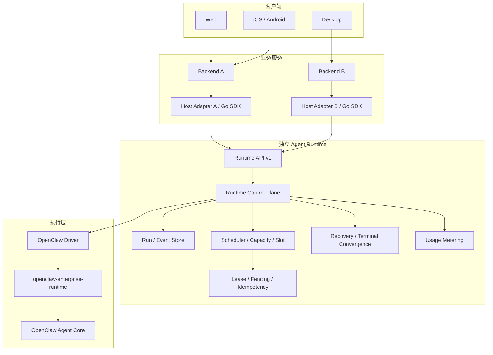
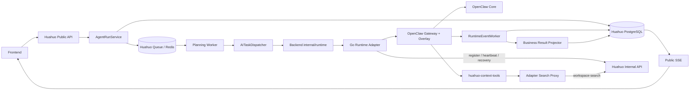
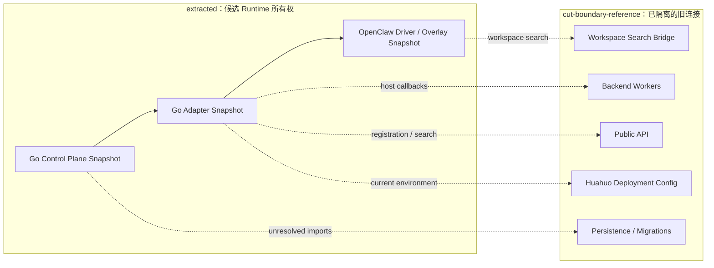
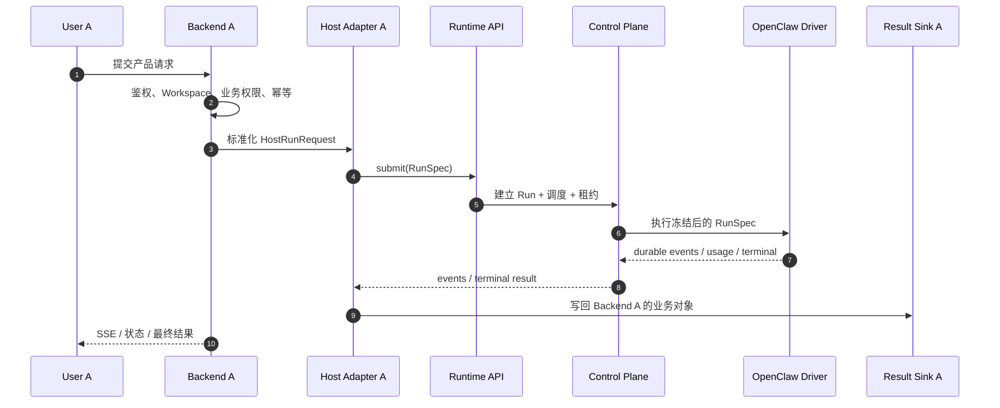
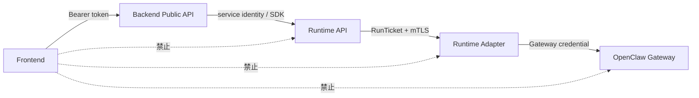
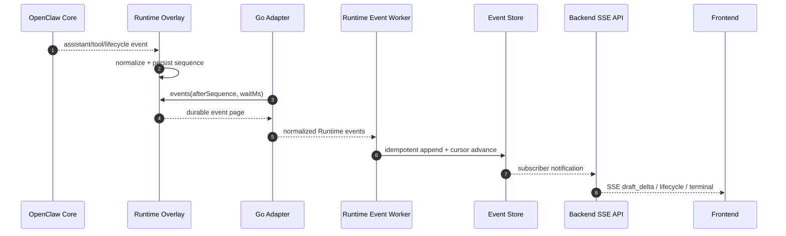
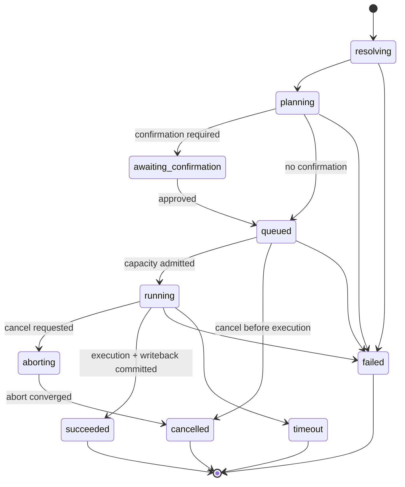
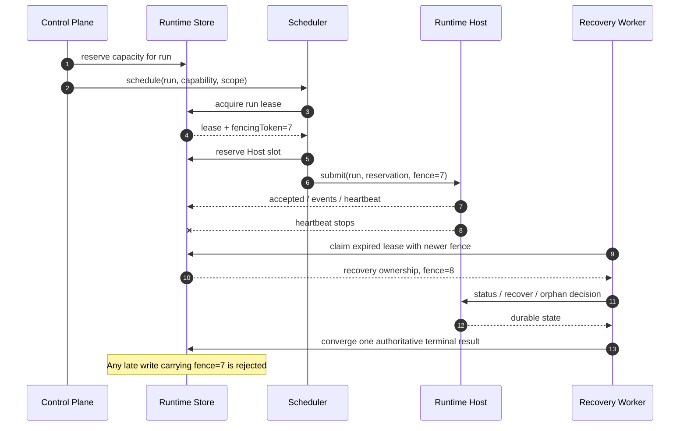
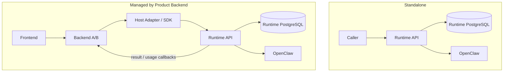

# Huahuo Enterprise Agent Runtime

Huahuo Agent Runtime 的无改码抽取快照。

[](LICENSE)

> 当前状态：`extraction snapshot`，不是可独立构建或部署的发行版。
>
> 本次只把现有 Runtime 相关源码从 Huahuo 工程复制出来并按边界分区。复制的源码没有做包名、import、配置、协议或业务逻辑修改；没有执行测试、构建、启动或哈希校验。

## 1. 这次到底做了什么

本目录完成的是第一次“剪脐带”：

1. 将 Runtime 控制面、Go Runtime Adapter 和 OpenClaw Driver/Overlay 从原工程复制到 `extracted/`。
2. 将仍然属于 Huahuo Backend 的 Worker、公开 API、数据库、Workspace Search 和部署配置隔离到 `cut-boundary-reference/`。
3. 不复制完整 Huahuo Backend，不复制 `.git`、缓存、构建产物、发布制品、日志、密钥或线上数据。
4. 不把 OpenClaw Agent Core 冒充为本项目原创代码。OpenClaw Core 继续作为外部底座。
5. 有意不在根目录创建 `go.mod`、启动命令或 Docker Compose，避免把尚未完成的逻辑解耦伪装成可运行产品。

这里的“切断”是**目录和所有权边界切断**，不是代码已经完成解耦。原始 import 和 Backend 回调仍保留在快照中，方便下一阶段逐一替换。

## 2. 目录结构

```text
E:\Rungtime
├── README.md
├── extracted
│   ├── go-runtime-control-plane
│   │   └── internal/runtime
│   │       ├── Run / Host / Session 模型
│   │       ├── Scheduler / Capacity / Slot
│   │       ├── Lease / Fencing
│   │       ├── Recovery / Terminal Convergence
│   │       ├── Runtime Event / Tool Audit
│   │       └── Workspace Materialization / RunTicket
│   ├── go-runtime-adapter
│   │   └── cmd/openclaw-runtime-adapter
│   │       ├── Runtime HTTP transport
│   │       ├── Gateway client
│   │       ├── Host registration / heartbeat
│   │       ├── recovery bridge
│   │       └── Workspace Search proxy
│   └── openclaw-driver
│       ├── overlay
│       │   ├── enterprise Run registry/store
│       │   ├── async Runtime methods
│       │   ├── capability handshake
│       │   ├── policy / recovery
│       │   └── source tests
│       └── tooling
│           ├── Overlay installer
│           ├── Runtime contract generator
│           └── Runtime source validation tooling
└── cut-boundary-reference
    ├── backend-workers
    │   ├── AI task dispatch
    │   ├── Runtime event ingestion
    │   ├── abort / recovery
    │   ├── queue heartbeat
    │   └── retention
    ├── public-api
    │   ├── routes
    │   ├── domain
    │   └── services
    ├── storage
    │   ├── persistence
    │   └── migrations
    ├── workspace-search
    │   └── huahuo-context-tools
    ├── deployment
    │   ├── config
    │   └── systemd
    └── go-module
        ├── go.mod
        └── go.sum
```

### 源码来源映射

| 新目录 | 原始目录 | 处理方式 |
| --- | --- | --- |
| `extracted/go-runtime-control-plane/internal/runtime` | `E:\huahuoai\backend\source\internal\runtime` | 整目录原样复制 |
| `extracted/go-runtime-adapter/cmd/openclaw-runtime-adapter` | `E:\huahuoai\backend\source\cmd\openclaw-runtime-adapter` | 整目录原样复制 |
| `extracted/openclaw-driver/overlay` | `E:\huahuoai\ops\source\openclaw-enterprise-runtime-overlay` | 整目录原样复制 |
| `extracted/openclaw-driver/tooling` | `E:\huahuoai\ops\source\runtime` | 整目录原样复制 |
| `cut-boundary-reference/backend-workers` | `E:\huahuoai\backend\source\internal\workers` | 只复制 Runtime、dispatch、heartbeat、retention 相关文件 |
| `cut-boundary-reference/public-api` | Backend 的 Agent Run route/domain/service | 作为宿主 API 参考，不属于 Runtime 正式边界 |
| `cut-boundary-reference/storage` | Backend persistence 与相关 migrations | 作为当前持久化事实参考 |
| `cut-boundary-reference/workspace-search` | Ops 的 `huahuo-context-tools` | 当前仍回调 Huahuo Backend，故隔离 |
| `cut-boundary-reference/deployment` | 当前 Runtime 配置与 systemd unit | 仅作现状参考，不能直接用于新服务 |
| `cut-boundary-reference/go-module` | Backend 根 `go.mod/go.sum` | 仅保留原依赖版本，不作为本目录模块入口 |

本快照来自 2026-09-02 的当前本地工作树。原 Backend 工作树当时已有用户未提交改动，本次没有清理、重置或覆盖它；复制出来的是当时磁盘上的当前内容，而不是回退后的旧提交内容。

## 3. 对外应该怎样描述

建议口径：

> 基于 OpenClaw Agent Core，我们实现了面向生产并发的企业级 Agent Runtime 控制面，包括 Run 生命周期、调度、容量、Lease、Fencing、恢复、事件收敛、Usage 和多租户 Workspace 边界。

不建议说“OpenClaw Agent Core 是我们从零自研的”。本项目的原创重点在 OpenClaw 之上的企业 Runtime Overlay、控制面、Adapter 和生产治理。

```text
OpenClaw Agent Core                  上游执行内核
openclaw-enterprise-runtime         固定版本的 Core 发行底座
OpenClaw Driver / Overlay           企业协议和执行桥接
Huahuo Runtime Control Plane        并发、状态、恢复与治理
Host Adapter / SDK                  业务 Backend 接入边界
Backend A / Backend B               各自产品、用户与业务数据
```

当前目录没有复制完整 OpenClaw Core。OpenClaw 继续由其官方独立仓库和原许可证维护：

`https://github.com/openclaw/openclaw`

本仓库是独立项目，不是 OpenClaw 的 Fork，也不代表 OpenClaw 官方。Huahuo 原创代码采用 `AGPL-3.0-only`；OpenClaw 及其他第三方代码仍适用各自许可证，详见 [THIRD_PARTY_NOTICES.md](THIRD_PARTY_NOTICES.md)。

## License

Copyright (c) 2026 Huahuo AI contributors.

本仓库中由 Huahuo 创作的代码按 [GNU Affero General Public License v3.0 only](LICENSE) 发布。修改本项目并通过网络向用户提供服务时，必须依照 AGPL v3 第 13 条向这些用户提供相应源码。

第三方组件不因本仓库采用 AGPL 而被重新许可。OpenClaw Agent Core 未包含在本仓库中；其许可证和署名见 [THIRD_PARTY_NOTICES.md](THIRD_PARTY_NOTICES.md)。

## 4. 目标架构



### 每层职责

| 层 | 负责 | 不负责 |
| --- | --- | --- |
| 前端 | 登录态、提交用户输入、展示进度、SSE 断线续传、取消按钮 | RunTicket、Host、Lease、Fence、模型密钥、真实 Workspace 路径 |
| Backend A/B | 用户与租户鉴权、Workspace/Thread、业务对象、产品权限、结果展示、计费策略 | 执行模型循环、管理 OpenClaw 本地状态 |
| Host Adapter / SDK | 将业务请求转成 Runtime contract；接收事件和结果回调 | 决定 Runtime 内部调度算法 |
| Runtime API v1 | `submit/status/events/abort/capabilities` 的稳定服务契约 | 暴露业务数据库结构或 OpenClaw 私有协议给前端 |
| Runtime Control Plane | Run、Scheduler、容量、Slot、Lease、Fence、恢复、事件、Usage | 获客、选题、人设等具体业务规则 |
| OpenClaw Driver | Runtime DTO 与 OpenClaw Gateway 方法的转换、能力握手、错误归一化 | 用户身份和业务结果持久化 |
| openclaw-enterprise-runtime | 固定并封装可验证的 OpenClaw 发行底座 | Huahuo 产品业务 |
| OpenClaw Agent Core | Agent loop、模型调用、Tool 执行和会话能力 | 企业多租户控制面 |

## 5. 当前代码的真实连接方式

以下是抽取前的实际主链路，不是目标架构的理想化版本：



### 已找到的脐带

| 编号 | 当前连接 | 为什么仍是 Backend 依赖 | 后续替换目标 |
| --- | --- | --- | --- |
| C1 | Adapter 直接 import `huahuoai/backend/source/internal/runtime` | DTO、RunTicket、mTLS、Materializer 和恢复类型位于 Backend `internal` 包 | 独立 `contracts` 与 `runtime-sdk-go` 包 |
| C2 | Scheduler import `internal/domain`、`internal/persistence`、`internal/queue` | 错误模型、PostgreSQL 事务和分布式锁属于 Huahuo 模块 | Runtime 自有 error/store/lease ports |
| C3 | Adapter 调用 `/internal/v1/runtime-hosts/*` | Host 注册、心跳和恢复权威在 Huahuo Backend | Runtime 自有 Host Control API，或标准 Host callbacks |
| C4 | Workspace Search 回调 `/internal/v1/runtime/workspace-search` | 索引和 Workspace 权限在 Huahuo Backend | `WorkspaceSearchProvider` Host Adapter |
| C5 | `AITaskDispatcher` 组装 Huahuo Plan/Workspace/业务上下文 | 通用调度与产品业务混在同一 Worker | Backend 负责组装，Runtime 只接收标准 RunSpec |
| C6 | `RuntimeEventWorker` 同时摄取事件和写回业务结果 | Runtime 终态与业务投影不是同一所有权 | Runtime 先完成标准终态，再调用 `ResultSink` |
| C7 | Terminal converger 直接更新 `agent_runs`、plan、queue、usage | Runtime 状态机绑定 Huahuo 表结构 | Runtime Event Store + Host Result/Usage callbacks |
| C8 | Runtime config 使用 Huahuo 路径、Profile、Plugin 和 Prompt | 配置不能直接复用到 Backend B | 通用配置 schema + 每个 Host 的独立配置 |
| C9 | systemd unit 绑定当前 Huahuo 服务器目录 | 它是部署现状，不是可移植发行物 | 独立容器或 Runtime 自有稳定 unit |

## 6. 本次切断后的状态



已经切断的是：

- 新目录不再包含完整 Huahuo Backend。
- Backend Worker、公开 API、数据库和部署连接点不再混在 Runtime 候选源码目录中。
- OpenClaw Core 不被复制进本项目，也不改变其上游历史。
- 没有根模块和启动入口，因此不会意外把这份快照部署成服务。

尚未切断的是：

- Go import 仍指向 `huahuoai/backend/source/internal/...`。
- Adapter 的生产启动仍要求 Huahuo Host registration、mTLS 和 recovery 配置。
- Scheduler、Event Worker、Terminal Converger 仍理解 Huahuo 数据表和队列。
- Workspace Search Plugin 仍通过 Adapter 回调 Huahuo Backend。
- 当前配置仍包含 Huahuo 的路径、Profile 和产品 Prompt。

因此当前快照**预期不能独立编译或启动**。这是本次“不改任何代码”的直接结果，不是遗漏。

## 7. Backend A 和 Backend B 怎样共用 Runtime

两个 Backend 不应该覆盖或复制 Runtime。它们各自实现 Host Adapter，然后调用同一套 Runtime API。



Backend B 走相同流程，只替换：

- `IdentityProvider`：如何解析 tenant/user。
- `WorkspaceProvider`：如何提供只读/可写 Workspace 快照。
- `PolicyProvider`：允许哪些 Agent、Skill、Tool、模型和预算。
- `SearchProvider`：如何检索 Backend B 的知识数据。
- `UsageSink`：如何预留、结算和展示用量。
- `ResultSink`：如何写回 Backend B 的消息和业务对象。

Runtime 不应该知道“获客、选题、人设、视频分析”等产品词；这些都留在具体 Backend 和 Agent Package 中。

## 8. 前端到底调用谁

结论：**前端只调用自己的 Backend，不直接调用 Runtime Adapter、OpenClaw Gateway 或 OpenClaw Core。**



浏览器不能获得或提交以下字段：

- `tenantId`、`userId` 的可信值；它们来自登录态。
- `runtimeHostId`、`reservationId`、`fencingToken`。
- `RunTicket`、JTI、mTLS 证书、Gateway token。
- `runtimeConfigId`、Provider、模型密钥、Tool allowlist。
- Workspace 真实路径、对象存储签名地址、内部 Session key。

### 8.1 前端基础配置

```ts
export const API_BASE_URL = `${deploymentOrigin}/api/v1`;

export function apiHeaders(accessToken: string, requestId: string) {
  return {
    Accept: "application/json",
    Authorization: `Bearer ${accessToken}`,
    "X-Request-Id": requestId,
    "X-Trace-Id": requestId,
  };
}
```

不要在正式客户端硬编码服务器 IP，也不要重复拼接 `/api/v1`。有 JSON body 的请求增加：

```text
Content-Type: application/json; charset=utf-8
```

所有创建、确认、取消等 mutation 使用新的 `X-Idempotency-Key`。同一次网络重试使用同一个 key 和完全相同的 body；用户主动发起新任务时生成新 key。

### 8.2 推荐的产品提交方式

产品聊天优先走 Backend 的 Chat API，而不是直接把 Runtime DTO 暴露给前端：

```http
POST /api/v1/chat/threads/{threadId}/messages
Authorization: Bearer <access-token>
X-Request-Id: <request-id>
X-Idempotency-Key: <idempotency-key>
Content-Type: application/json; charset=utf-8
```

```json
{
  "agentProfileId": "agent_profile_from_catalog",
  "skillProfileIds": ["optional_skill_profile_from_catalog"],
  "input": {
    "content": [
      {
        "type": "text",
        "text": "请整理今天最重要的三件事"
      }
    ]
  }
}
```

典型接受响应：

```json
{
  "success": true,
  "data": {
    "userMessage": {},
    "run": {
      "agentRunId": "run_opaque_id",
      "status": "planning"
    },
    "nextAction": {
      "type": "poll_agent_run",
      "agentRunId": "run_opaque_id",
      "afterSequence": 0
    }
  }
}
```

HTTP `202 Accepted` 只代表任务已持久化接收，不代表 Agent 已经成功完成。

当前 Huahuo Backend 还保留这些公开 Run 路由作为参考：

| 方法 | 路径 | 前端用途 |
| --- | --- | --- |
| `POST` | `/api/v1/agent/runs` | 直接创建 Run facade；具体请求形状由宿主 Backend 的公开合同决定 |
| `GET` | `/api/v1/agent/runs/{agentRunId}` | 查询公开 Run 状态和终态结果 |
| `GET` | `/api/v1/agent/runs/{agentRunId}/events` | 增量拉取公开事件 |
| `GET` | `/api/v1/agent/runs/{agentRunId}/events/stream` | SSE 实时事件流 |
| `POST` | `/api/v1/agent/runs/{agentRunId}/confirm` | 确认需要审批的 Plan |
| `POST` | `/api/v1/agent/runs/{agentRunId}/cancel` | 用户取消，不是删除 |

### 8.3 前端如何检查状态

优先顺序：

```text
提交成功
  -> 打开 SSE
  -> 按 sequence 更新 UI
  -> 收到 terminal
  -> GET Run 做最终读回
  -> 成功时刷新 Thread，确认 Assistant 消息已经持久化

SSE 不可用
  -> GET events 增量轮询
  -> 必要时 GET Run 状态轮询
  -> 终态停止
```

查询 Run：

```http
GET /api/v1/agent/runs/{agentRunId}
Authorization: Bearer <access-token>
X-Request-Id: <request-id>
```

公开状态只有以下集合：

| 状态 | 含义 | 前端动作 |
| --- | --- | --- |
| `resolving` | 正在解析意图 | 展示处理中，继续监听 |
| `planning` | 正在规划 | 展示处理中，继续监听 |
| `awaiting_confirmation` | 等待用户确认 Plan | 展示确认操作 |
| `queued` | 已完成规划，等待 Runtime 容量 | 展示排队中，继续监听 |
| `running` | Runtime 正在执行 | 展示运行中和 draft |
| `aborting` | 已收到取消请求，正在收敛 | 禁用重复取消，继续监听 |
| `succeeded` | Runtime 和业务写回均成功 | 读取结果并刷新 Thread |
| `failed` | 安全终态失败 | 展示可公开错误，根据 `retryable` 决定重试 |
| `timeout` | 超时终态 | 停止监听，允许用户发起新 Run |
| `cancelled` | 取消终态 | 停止监听 |

终态集合固定为：

```ts
const TERMINAL_RUN_STATES = new Set([
  "succeeded",
  "failed",
  "timeout",
  "cancelled",
]);
```

前端不需要查询 OpenClaw 的 `accepted/materializing/finalizing/orphaned` 等内部状态。Backend 会把它们投影成稳定的公开状态。

### 8.4 SSE 调用

```http
GET /api/v1/agent/runs/{agentRunId}/events/stream
Authorization: Bearer <access-token>
Accept: text/event-stream
Last-Event-ID: <last-sequence>
```

浏览器原生 `EventSource` 不能可靠设置 `Authorization` header。当前 Bearer 鉴权接口应使用支持流式 body 的 `fetch`，或者由同源 BFF 使用安全 Cookie 代理；不要把 access token 放进 URL。

下面是最小的 Bearer SSE 读取骨架：

```ts
type RunEvent = {
  sequence: number;
  eventType: string;
  status: string;
  data?: Record<string, unknown>;
  createdAt: string;
};

export async function watchRun(
  runId: string,
  accessToken: string,
  afterSequence: number,
  onEvent: (name: string, event: RunEvent) => void,
  signal?: AbortSignal,
) {
  const headers: Record<string, string> = {
    Accept: "text/event-stream",
    Authorization: `Bearer ${accessToken}`,
  };
  if (afterSequence > 0) {
    headers["Last-Event-ID"] = String(afterSequence);
  }

  const response = await fetch(
    `${API_BASE_URL}/agent/runs/${encodeURIComponent(runId)}/events/stream`,
    { headers, signal },
  );
  if (!response.ok || !response.body) {
    throw new Error(`agent_run_stream_failed:${response.status}`);
  }

  const reader = response.body.getReader();
  const decoder = new TextDecoder();
  let buffer = "";

  while (true) {
    const { done, value } = await reader.read();
    buffer += decoder.decode(value, { stream: !done }).replaceAll("\r\n", "\n");

    let boundary: number;
    while ((boundary = buffer.indexOf("\n\n")) >= 0) {
      const frame = buffer.slice(0, boundary);
      buffer = buffer.slice(boundary + 2);
      if (!frame || frame.startsWith(":")) continue;

      let id = "";
      let name = "message";
      const data: string[] = [];
      for (const line of frame.split("\n")) {
        if (line.startsWith("id:")) id = line.slice(3).trim();
        else if (line.startsWith("event:")) name = line.slice(6).trim();
        else if (line.startsWith("data:")) data.push(line.slice(5).trimStart());
      }
      if (!data.length) continue;

      const event = JSON.parse(data.join("\n")) as RunEvent;
      onEvent(name, event);
      if (id) afterSequence = Number(id);
      if (name === "terminal") return afterSequence;
    }

    if (done) return afterSequence;
  }
}
```

事件格式：

```text
id: 18
event: draft_delta
data: {"sequence":18,"eventType":"draft_delta","status":"running","data":{"deltaText":"...","replace":false}}
```

处理规则：

- `id` 就是持久化事件 `sequence`，每处理成功一条再更新本地 cursor。
- `draft_delta.data.deltaText` 是可展示草稿；`replace=true` 时替换当前草稿，否则追加。
- `event: terminal` 后关闭流，再查询一次 Run 和 Thread。
- `: heartbeat` 是注释帧，只用于保活，不更新 cursor。
- 断线后使用 `Last-Event-ID` 恢复。不要同时发送不同值的 query `afterSequence` 和 `Last-Event-ID`。
- `RUNTIME_EVENT_GAP` 表示旧事件已超出保留窗口；使用服务端给出的 `resumeAfterSequence` 重新拉取事件页和 Run 当前状态。
- `RUNTIME_CAPACITY_UNAVAILABLE` 表示 SSE admission 暂不可用；按 `Retry-After` 退避，同时降级到轮询。

### 8.5 事件轮询 fallback

```http
GET /api/v1/agent/runs/{agentRunId}/events?afterSequence=18&limit=100
Authorization: Bearer <access-token>
```

典型响应：

```json
{
  "success": true,
  "data": {
    "items": [],
    "nextAfterSequence": 18,
    "hasMore": false,
    "oldestAvailableSequence": 1,
    "latestSequence": 18,
    "terminalSequence": null,
    "gap": false
  }
}
```

轮询间隔优先读取 `GET /api/v1/app/config` 的 `polling.aiTaskMs`。没有配置时可暂用约 3 秒；页面回到前台后立即读一次服务端状态，不只相信本地 pending 状态。

### 8.6 取消与确认

取消：

```http
POST /api/v1/agent/runs/{agentRunId}/cancel
Authorization: Bearer <access-token>
X-Request-Id: <request-id>
X-Idempotency-Key: <idempotency-key>
Content-Type: application/json; charset=utf-8

{"reason":"user_cancelled"}
```

取消不是删除。收到 `202` 后继续监听，直到 `cancelled` 或另一个终态。

确认 Plan：

```http
POST /api/v1/agent/runs/{agentRunId}/confirm
Authorization: Bearer <access-token>
X-Idempotency-Key: <idempotency-key>
Content-Type: application/json; charset=utf-8

{"expectedPlanVersion":3,"decision":"approve"}
```

只有 `awaiting_confirmation` 可以确认。客户端不能修改服务端冻结的 Plan 内容。

## 9. Runtime API：只给 Backend / SDK 调用

当前 Go Adapter 已有一套内部异步 HTTP 面。它可以作为 Runtime API v1 的实现参考，但**不是浏览器 API**。

| 方法 | 当前路径 | 作用 |
| --- | --- | --- |
| `POST` | `/enterprise.runtime/runs` | 提交冻结后的 RunSpec |
| `GET` | `/enterprise.runtime/runs/{runId}` | 查询 Runtime 内部状态 |
| `GET` | `/enterprise.runtime/runs/{runId}/events` | 按 sequence 增量读取；支持 `waitMs` 长轮询 |
| `POST` | `/enterprise.runtime/runs/{runId}/abort` | 使用 reservation + fencing 发起中止 |
| `GET` | `/enterprise.runtime/capabilities` | 读取 Runtime/Tool 能力握手 |

旧的 `/enterprise.runtime.run` 在 production-like 环境会返回 `410 RUNTIME_LEGACY_CONTRACT_DISABLED`，新接入不得使用。

### 9.1 内部鉴权

生产链路至少包含：

```text
mTLS Runtime Host identity
Authorization: RunTicket <short-lived-signed-ticket>
X-Runtime-Host-Id: <scheduled-host-id>
```

Submit 还可以由控制面发送冻结后的预算 header：

```text
X-Huahuo-Runtime-Timeout-Sec: <bounded-seconds>
X-Huahuo-Runtime-Max-Tool-Calls: <bounded-count>
```

这些 header 名称是当前快照事实，后续独立 API 可以在兼容层保留，再逐步改为中性名称。RunTicket 不进入 JSON，不进入日志，也不返回前端。

### 9.2 Submit

```http
POST /enterprise.runtime/runs
Authorization: RunTicket <signed-ticket>
X-Runtime-Host-Id: runtime-host-01
Content-Type: application/json
```

当前请求的顶层结构：

```json
{
  "runId": "run_opaque_id",
  "reservationId": "reservation_opaque_id",
  "fencingToken": 7,
  "capabilityHash": "capability_identity",
  "inputMessage": "short current user turn",
  "runtimeConfigId": "runtime-config-id",
  "runtimeConfigVersion": "v1",
  "inputManifest": {
    "schemaVersion": "runtime-input-manifest-version",
    "runId": "run_opaque_id",
    "runtimeHostId": "runtime-host-01",
    "tenantId": "server-derived-tenant",
    "userId": "server-derived-user",
    "workspaceId": "server-derived-workspace",
    "workspaceVersion": 1,
    "threadWorkspaceBindingVersion": 1,
    "contextGeneration": 1,
    "metaRelease": "frozen-meta-release",
    "agentProfile": "internal-agent-profile",
    "skillProfiles": [],
    "capabilityHash": "capability_identity",
    "files": [],
    "manifestHash": "server-generated-identity",
    "expiresAt": "2026-09-02T12:00:00Z"
  },
  "plan": {
    "agentRunId": "run_opaque_id",
    "planVersion": 1
  },
  "productSessionRef": {}
}
```

这不是前端可手写的请求。`reservationId`、Fence、Manifest、Plan 和 Ticket 必须由 Scheduler/Host Adapter 从已持久化事实生成。

成功响应：

```json
{
  "runId": "run_opaque_id",
  "status": "accepted",
  "runtimeRequestId": "runtime_request_opaque_id",
  "acceptedSequence": 1
}
```

### 9.3 Status 与 Events

```http
GET /enterprise.runtime/runs/{runId}
Authorization: RunTicket <signed-ticket>
X-Runtime-Host-Id: runtime-host-01
```

```json
{
  "runId": "run_opaque_id",
  "status": "running",
  "runtimeRequestId": "runtime_request_opaque_id",
  "lastEventSequence": 12,
  "result": null,
  "error": null,
  "usage": {}
}
```

```http
GET /enterprise.runtime/runs/{runId}/events?afterSequence=12&limit=100&waitMs=25000
Authorization: RunTicket <signed-ticket>
X-Runtime-Host-Id: runtime-host-01
```

`limit` 当前必须在 `1..500`，`waitMs` 必须在 `0..25000`。这是 Backend Runtime Event Worker 的内部长轮询接口；前端使用公开 SSE，不直接轮询它。

### 9.4 Abort

```http
POST /enterprise.runtime/runs/{runId}/abort
Authorization: RunTicket <signed-ticket>
X-Runtime-Host-Id: runtime-host-01
Content-Type: application/json

{
  "runId": "run_opaque_id",
  "reservationId": "reservation_opaque_id",
  "fencingToken": 7,
  "reason": "USER_CANCELLED"
}
```

旧 attempt 的 fencing token 必须被拒绝，防止迟到的取消或终态污染新 attempt。

### 9.5 Capabilities

```http
GET /enterprise.runtime/capabilities
X-Runtime-Host-Id: runtime-host-01
```

能力握手用于 Scheduler/Host registration 校验 Runtime 版本、Tool schema、预算和中止能力。它不提供给前端做功能开关。

## 10. 为什么前端不用不停查 OpenClaw 状态

事件路径是分层的：



因此：

- Adapter/Worker 检查 OpenClaw Runtime 状态。
- Backend 保存公开事件和最终业务结果。
- 前端只监听 Backend SSE；断线时按公开 cursor 恢复。
- 前端在终态后再读一次 Run 和 Thread，不能用草稿或日志替代持久化结果。

## 11. 状态机与映射

### 11.1 前端公开状态机



### 11.2 Runtime 内部状态到公开状态

| Runtime/内部状态 | 公开状态 |
| --- | --- |
| `created`、`resolving_intent`、`resolving` | `resolving` |
| `planning` | `planning` |
| `awaiting_confirmation` | `awaiting_confirmation` |
| `admission_pending`、`queued` | `queued` |
| `reserving`、`dispatched`、`accepted`、`materializing`、`running`、`finalizing` | `running` |
| `aborting` | `aborting` |
| `succeeded` | `succeeded` |
| `cancelled`、`aborted` | `cancelled` |
| `timeout` | `timeout` |
| `failed`、`orphaned` | `failed` |

内部状态可以演进，前端公开状态集合必须保持稳定。未知内部状态不能直接泄漏给客户端。

## 12. Lease、Fence 和恢复为什么必须留在 Runtime



关键不变量：

- 一个 Run attempt 只能有一个有效 owner。
- Lease 到期不等于旧 owner 可以继续写。
- 每次重新取得所有权都增加 fencing token。
- terminal、usage、queue acknowledgement 和 slot release 必须幂等。
- Gateway 重启后 SQLite 可以保留 Run/Event，但不能凭空恢复正在运行的模型循环。
- 无法证明安全续跑时进入 `orphaned`，由控制面授权新 attempt，而不是重复消费旧 Ticket。

## 13. 数据所有权

| 数据 | 权威所有者 | Runtime 可见范围 |
| --- | --- | --- |
| 用户、租户、Membership | Backend A/B | 只接收服务端派生的不可变执行身份 |
| Thread、消息、业务对象 | Backend A/B | 只接收 RunSpec；通过 ResultSink 请求写回 |
| Workspace 当前版本 | Backend A/B | 使用冻结快照和受限读写能力 |
| Run 调度、Host、Slot、Lease、Fence | Runtime Control Plane | 完整权威 |
| Runtime 原始事件 | Runtime Event Store | 完整权威，但只投影安全字段给 Backend |
| 前端公开事件 | Backend public event projection | 不含 Ticket、路径、Provider、Tool 私有 payload |
| Provider credential | Secret/Provider 管理层 | Runtime 只使用引用，不返回原值 |
| Usage execution facts | Runtime | 产生不可变 usage facts |
| Credit/套餐/账务 | Backend A/B | 根据 usage facts 完成业务结算 |
| 最终 Assistant 消息 | Backend A/B | Runtime 提供结果，Backend 持久化后才算产品成功 |

## 14. 错误处理

内部 Runtime 当前可见的主要安全错误包括：

| 错误码 | 含义 | 默认处理 |
| --- | --- | --- |
| `RUNTIME_INPUT_INVALID` | DTO、Manifest、Plan、预算或绑定无效 | 不重试原请求；修正 Host Adapter |
| `RUNTIME_PERMISSION_DENIED` | Ticket、Run、Workspace 或操作不匹配 | 不降级绕过权限 |
| `RUNTIME_HOST_UNAUTHORIZED` | Host/mTLS 身份无效 | 隔离 Host，重新注册 |
| `RUNTIME_CAPACITY_UNAVAILABLE` | Slot、并发或 admission 暂不可用 | 有界退避，保留同一 Run |
| `RUNTIME_STORAGE_UNAVAILABLE` | 持久化/JTI/Event Store 不可用 | fail closed，不以内存成功替代 |
| `RUNTIME_RUN_NOT_FOUND` | Run 不存在或不可见 | 由恢复逻辑核对，不由前端猜 ID |
| `RUNTIME_EVENT_GAP` | cursor 早于最老保留事件 | 按服务端 resume cursor 重建公开视图 |
| `RUNTIME_TIMEOUT` | 执行超时 | 终态收敛并释放资源 |
| `RUNTIME_RUN_STALLED` | 无进展或失联 | Recovery 决策，不盲目重复执行 |
| `RUNTIME_ABORT_FAILED` | 中止请求未安全确认 | 保持 `aborting`/恢复流程，不伪造取消成功 |
| `PROVIDER_CONFIG_MISSING` | Provider 配置缺失 | 运维修复，不让前端选择密钥 |
| `PROVIDER_AUTH_FAILED` | Provider 鉴权失败 | 隔离对应 credential/pool |
| `RUNTIME_TOOL_BUDGET_EXCEEDED` | Tool 调用预算耗尽 | 安全终止并记录 Usage |

前端只消费 Backend 注册过的公开错误结构，例如：

```json
{
  "success": false,
  "error": {
    "code": "RUNTIME_CAPACITY_UNAVAILABLE",
    "message": "safe user-facing message",
    "retryable": true,
    "traceId": "public-trace-id"
  }
}
```

不要把 Runtime stderr、Provider 原始响应、绝对路径、Prompt、Token 或 Tool payload 原样展示给用户。

## 15. 下一阶段需要补的接口

这些是下一阶段的新代码目标，本次没有实现：

```go
type RunStore interface {
    CreateRun(...)
    GetRun(...)
    CompareAndSetState(...)
}

type EventStore interface {
    Append(...)
    ListAfter(...)
    Subscribe(...)
}

type LeaseStore interface {
    Acquire(...)
    Renew(...)
    Release(...)
}

type HostAdapter interface {
    ResolveIdentity(...)
    ResolveWorkspace(...)
    SearchWorkspace(...)
    ReserveUsage(...)
    CommitUsage(...)
    CommitResult(...)
}
```

实际落地顺序应保持最小：

```text
1. 独立 contracts：移出 DTO、状态和错误码
2. Runtime store ports：替换 domain/persistence/queue import
3. PostgreSQL 实现：迁入通用 Run/Host/Lease/Event 表
4. Host Adapter：先接回 Huahuo Backend A
5. Go SDK：让 Backend B 使用同一 Runtime API
6. Standalone server：最后再补启动、配置和容器
```

不应先重写 Scheduler、Lease 或 Fencing 算法。先把已验证逻辑放到新接口后面，再逐步迁移所有权。

## 16. Standalone 与 Managed 模式

未来可以支持两种运行方式：



- Standalone 适合内部服务、脚本和无复杂业务对象的调用方。
- Managed 适合正式产品，由 Backend 管用户、Workspace、账务、消息和业务写回。
- 两种模式共用同一 Run/Event/Scheduler/Recovery 核心，不复制 Runtime。

## 17. 当前不能做的事情

在完成下一阶段之前，不要：

- 在本目录运行 `go build ./...` 并期待成功。
- 直接复制 `cut-boundary-reference/deployment` 到新服务器。
- 把当前 Huahuo config 当成通用默认配置。
- 让浏览器调用 `/enterprise.runtime/*`。
- 让新 Backend 自己生成或伪造 fencing token、RunTicket 或 Workspace 路径。
- 宣称本快照已经完成独立运行、兼容性测试或生产验收。
- 删除 `cut-boundary-reference` 中的旧连接点，直到相应的新接口已经实现并验证。

## 18. 本次操作声明

- 原始目录：只读取和复制，没有移动或修改。
- 新目录：创建 `E:\Rungtime`，复制源码并新增本 README。
- 服务器：未连接，未部署，未重启任何服务。
- 测试：按要求未运行。
- 构建：未运行。
- 哈希校验：按要求未运行。
- 当前结论：物理抽取和边界隔离已完成；逻辑解耦留待下一阶段补接口。
