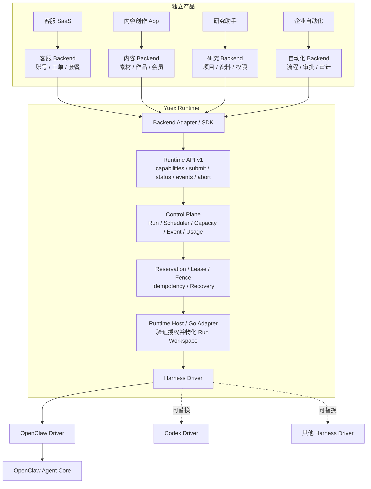

# Yuex Agent Runtime

[](LICENSE)

Yuex 提供可复用的 Agent 生产运行层。产品 Backend 负责用户、权限、业务数据和计费；Yuex 负责 Run 调度、并发控制、故障恢复、事件记录和 Harness 接入。

当前 OpenClaw Driver 接入 [OpenClaw](https://github.com/openclaw/openclaw)。感谢 OpenClaw 社区提供开源的 Agent Loop、Session 和 Tool 基础。OpenClaw Core 不是本项目的原创代码；Yuex 实现的是它上方的生产控制层。通过实现新的 Harness Driver，同一控制面可以接入 Codex 或其他 Agent Runtime。

> 本仓库是从现有工程复制的实现快照。核心机制来自实际运行代码，但部分 Go import、持久化和回调仍与原 Backend 相连。当前版本用于阅读、验证边界和继续独立化，不是开箱即用的独立发行版。

## Overview

Yuex 将系统状态分为三类：

| 状态 | 所有者 | 内容 |
| --- | --- | --- |
| 产品业务状态 | 产品 Backend | 账号、组织、会员、价格、余额、业务权限、产品 Thread、素材和正式资产 |
| Runtime 执行状态 | Yuex Control Plane | Run、队列、容量、Reservation、Lease、Fence、事件、恢复检查点和原始 Usage |
| Agent 上下文状态 | OpenClaw、Codex 等 Harness | 原生 Session、模型消息、Tool 结果、上下文压缩检查点和 Agent Loop |

Yuex 不保存产品业务状态，但不是无状态代理。Control Plane 必须持久化执行状态，才能处理并发、网络重试、进程重启和 Host 丢失。

Runtime 记录模型 Token、Tool 调用和执行时间等原始 Usage。Backend 根据自己的套餐、币种和价格规则完成结算；Runtime 不定义产品售价。

## Architecture

下图中的客服、内容、研究和自动化服务是彼此独立的产品示例，不是同一产品的四个模块。每个产品保留自己的 Backend，也可以共用同一套 Yuex Runtime。



产品 Backend 决定谁能发起任务、任务可以读取哪些数据、结果写回哪里。Yuex 决定 Run 在哪个 Host 执行、当前所有者是否有效、事件是否连续以及故障后如何恢复。Harness 执行模型、Session 和 Tool 循环。

## Example

以下示例接入一个内容创作服务。产品 API 的路由和字段由 Backend 自行定义，不属于 Yuex 协议。

```http
POST /api/agent-runs
Content-Type: application/json
```

```json
{
  "workspaceId": "workspace_alice_content",
  "threadId": "thread_launch_copy",
  "agentProfileId": "content_writer",
  "skillProfileIds": ["note_to_post"],
  "input": {
    "text": "把昨天上传的产品笔记改成一篇小红书文章，保持品牌语气"
  },
  "attachments": [
    {"resourceId": "resource_note_cover", "usage": "primary_input"}
  ]
}
```

Backend 完成以下处理：

1. 从登录态解析 Tenant 和 User，检查 Workspace、素材及产品套餐权限。
2. 将请求转换为 `TaskIntent`，从当前 Catalog 选择 Agent Profile、Skill、Knowledge、Tool Policy 和 Runtime Config。
3. 冻结 `AgentRunPlan`、`RuntimeInputManifest`、Workspace 版本和 Session 映射。
4. 调用 Yuex `submit`。Yuex 排队、分配 Host、建立 Lease，并物化隔离的 Run Workspace。
5. OpenClaw 执行模型与 Tool 循环；Yuex 记录进度、审计事件、Usage 和唯一终态。
6. Backend 校验输出，将文章写入产品数据，并按自己的价格规则结算 Usage。

Frontend 使用 Backend 提供的查询和 SSE 接口读取结果，例如：

```http
GET    /api/agent-runs/{runId}
GET    /api/agent-runs/{runId}/events?cursor={cursor}
DELETE /api/agent-runs/{runId}
```

Frontend 不连接 Runtime Host 或 OpenClaw，也不持有 Provider Key、RunTicket、Lease、Fence、Harness Session Key 或真实 Workspace 路径。

## Backend Integration

Backend 在提交 Run 前准备以下数据：

| 数据 | 内容 |
| --- | --- |
| Identity | `tenantId`、`userId`、`workspaceId` 及已经完成的业务鉴权结果 |
| Run | 稳定且幂等的 `runId`、任务输入、超时和取消语义 |
| Plan | Agent Profile、Skill、Knowledge Ref、Tool Policy、Runtime Config 和 Output Contract 的固定版本 |
| Manifest | 本次允许读取的逻辑文件、来源、版本、大小和内容身份 |
| Session | 产品 `threadId`、服务端 Harness Session Key 和 `contextGeneration` |
| Result | 业务写回位置和唯一终态处理规则 |
| Usage | 接收原始用量所需的业务关联；价格和账单仍由 Backend 计算 |

数据库连接串、业务表名、Provider 明文密钥和任意服务器文件路径不得放入 Runtime 请求。Workspace Adapter 将数据库记录和对象存储资源转换为 Manifest 中的受控引用。

### Identifiers

| 字段 | 含义 | 示例 | 创建方 |
| --- | --- | --- | --- |
| `tenantId` | 数据和权限的最高隔离边界；通常对应公司、团队或客户组织 | `tenant_acme` | Backend |
| `userId` | 发起操作的人或服务身份 | `user_alice` | Backend |
| `workspaceId` | 一组长期资料的逻辑容器 | `workspace_alice_content` | Backend |
| `threadId` | 产品中的连续对话或任务线程 | `thread_launch_copy` | Backend |
| `runId` | 一次 Agent 执行；一个 Thread 可以包含多个 Run | `run_20260902_001` | Backend / Control Plane |
| Harness Session Key | Thread 在 OpenClaw 或 Codex 中对应的原生会话标识 | `openclaw:session:...` | Session Adapter |
| `workspaceVersion` | 本次 Run 使用的不可变 Workspace 版本 | `17` | Workspace Provider |
| `contextGeneration` | Thread 与 Workspace 的上下文代次；切换 Workspace 或重建 Session 时递增 | `3` | Backend / Session Adapter |
| Catalog Revision | 本次可选 Agent、Skill、Tool 和配置的集合版本 | `catalog_2026_09_02` | 发布系统 |

单用户产品可以使用固定的 `tenantId`。`workspaceId` 是逻辑标识，不要求对应本地目录。`reservationId`、`fencingToken`、`capabilityHash` 和 `RunTicket` 由 Runtime 创建，前端和业务代码不应自行生成。

### Runtime Request

Backend Adapter 向 Runtime 提交的核心字段如下。实际协议还包含短期 RunTicket、精确的 Plan/Manifest 身份、附件身份和过期时间。

```json
{
  "runId": "run_20260902_001",
  "inputMessage": "把昨天上传的产品笔记改成一篇小红书文章",
  "runtimeConfigId": "content-default",
  "runtimeConfigVersion": "v7",
  "inputManifest": {
    "tenantId": "tenant_acme",
    "userId": "user_alice",
    "workspaceId": "workspace_alice_content",
    "workspaceVersion": 17,
    "contextGeneration": 3,
    "files": [
      {
        "logicalPath": "materials/note-42.md",
        "sourceType": "formal_workspace_ref",
        "sourceRef": "versioned-workspace-object"
      }
    ]
  },
  "plan": {
    "l1AgentProfile": "content_writer",
    "selectedSkillProfiles": ["note_to_post"],
    "selectedKnowledgeRefs": ["knowledge/content-writing/INDEX.md"],
    "requiredTools": ["read", "workspace_search"],
    "outputContract": {"format": "markdown"}
  },
  "productSessionRef": {
    "threadId": "thread_launch_copy",
    "harnessSessionKey": "server-owned-session-key"
  }
}
```

### Runtime API

| 操作 | 调用方 | 用途 |
| --- | --- | --- |
| `capabilities` | Control Plane / Adapter | 读取 Host 版本、Tool、Schema、预算和取消能力 |
| `submit` | Backend / Dispatcher | 幂等提交已经冻结并完成预约的 Run |
| `status` | Backend / Recovery | 对账状态、最新事件序号、结果、错误和 Usage |
| `events` | Backend / Event Worker | 按 sequence/cursor 增量读取进度、Tool、草稿和终态事件 |
| `abort` | Backend | 将用户取消转换为 Runtime 取消，并等待唯一终态 |

一个新 Backend 通常实现以下 Adapter：

| Adapter | 职责 |
| --- | --- |
| Identity | 从登录态解析 Tenant、User 和 Workspace，并完成业务权限检查 |
| Intent | 将页面操作或自由输入转换为 `TaskIntent`，校验 Profile 选择 |
| Workspace | 将业务对象、正式 Workspace 和附件转换为版本化 Manifest |
| Session | 保存 Thread 与 Harness Session Key 的映射，维护 `contextGeneration` |
| Catalog / Entitlement | 暴露公开 Catalog，并叠加产品会员和授权规则 |
| Runtime Client | 调用 `capabilities`、`submit`、`status`、`events` 和 `abort` |
| Event Projection | 将 Runtime Event 转换为产品查询接口或 SSE 数据 |
| Result Sink | 校验 Output Contract，将唯一终态写回产品数据 |
| Usage | 接收原始 Usage，并按产品价格规则结算 |

Runtime Store 随 Yuex 部署。产品 Backend 不需要另建一套 Run、Lease 或 Event 表。当前快照中仍与原 Backend 耦合的 Repository 后续应收敛为 Runtime 自有的存储端口和迁移。

<details>
<summary>Codex 接入任务模板</summary>

```text
把 <YOUR_BACKEND> 接入 Yuex Agent Runtime。

先读取 README.md 和 Repository Layout 中的 Runtime、Adapter、Driver 代码。定位产品中的 Identity、Workspace、Thread、Task、Result 和 Usage 数据所有者，并分别映射到 Backend 状态、Runtime 执行状态和 Harness Session 状态。

实现 Identity、Intent、Workspace、Session、Catalog、Event、Result 和 Usage Adapter；由服务端冻结 AgentRunPlan 与 RuntimeInputManifest；接入 capabilities、submit、status、events 和 abort。Frontend 只能访问 Backend。

保留 Workspace version、context generation、Reservation、Lease、Fence、RunTicket、幂等、Event cursor 和唯一终态语义。不得向 Agent 暴露数据库凭据、Provider Key、Host 路径或内部 Session Store。原 Backend 专属 Repository 和 callback 应改为 Runtime port，不得把产品业务表复制进 Runtime Core。

验证 submit 幂等、SSE 续传、取消、Host 丢失恢复、旧 Fence 拒写和长上下文压缩。
```

</details>

## Workspace

Workspace 是 Runtime Host 为单次 Run 物化的、带版本的文件系统视图。Backend 保留业务对象；Workspace Adapter 只把本次已授权的数据写入 Manifest。

| `sourceType` | 来源 | 示例 |
| --- | --- | --- |
| `meta_release_ref` | 已发布的 Agent、Skill 和平台知识 | `AGENTS.md`、`skills/note_to_post/SKILL.md` |
| `formal_workspace_ref` | 用户长期 Workspace 中的已授权资料 | `profile/brand-voice.md`、`materials/note-42.md` |
| `object_ref` | 对象存储附件，通过短期只读能力获取 | `input/attachments/01.png` |
| `inline` | 只属于本次 Run 的小型文本 | `input/user_request.md`、`input/context.md` |

Runtime Host 验证 RunTicket 和 Manifest 后物化目录：

```text
run-workspace/
├── AGENTS.md
├── SOUL.md
├── TOOLS.md
├── MEMORY.md
├── skills/
│   └── note_to_post/
│       ├── SKILL.md
│       └── references/
├── knowledge/
│   └── content-writing/INDEX.md
├── profile/brand-voice.md
├── materials/note-42.md
├── input/
│   ├── user_request.md
│   └── attachments/01.png
├── staging/
└── output/
```

Run 入队前固定以下内容：

- `workspaceId`、`workspaceVersion` 和 `contextGeneration`；
- 每个逻辑文件的来源、版本、大小和内容身份；
- Agent、Skill、Knowledge、Tool Policy 和 Runtime Config Release；
- 附件、输入策略、Output Contract 和 Runtime 能力版本。

执行期间发生的 Workspace 修改只影响后续 Run。Agent 修改正式资产时返回结构化结果或 `assetWriteIntent`，由 Backend 鉴权、校验并写入；Run Workspace 的临时 `write` 权限不能直接修改正式资料。

## Agent Catalog

| 对象 | 定义 |
| --- | --- |
| Catalog | 带不可变 Revision 的可用能力目录 |
| Agent Profile | 版本化的 Agent 角色和能力边界；绑定行为文件、候选 Skill、知识根、Tool Policy 和 Runtime Config |
| Skill | 一类任务的方法包；声明输入、步骤、所需能力、输出格式和失败条件 |
| Knowledge Ref | 本次 Run 可读取的精确知识入口 |
| Tool Policy | 本次 Run 的 Tool `allow`、`deny` 和写入边界 |
| Runtime Config | Provider、模型、Auth Pool、超时、Thinking、输出预算和 Plugin 配置 |
| Agent Release | Agent 文件及声明的一次不可变发布 |
| AgentRunPlan | 本次 Run 选定的 Agent、Skill、Knowledge、Tool、输出协议和版本 |

Profile 可以由用户从公开 Catalog 选择、由产品功能固定，或由 Backend 根据 `TaskIntent` 路由。三种入口都在服务端执行相同校验：

```text
TaskIntent + 已鉴权 Workspace + Catalog Revision
    → 过滤 active、scope、task type 和产品授权
    → 过滤 candidateSkillProfiles、required capabilities 和 Host 能力
    → 选择 Knowledge Refs、Tool Policy、Runtime Config 和 Output Contract
    → 冻结 AgentRunPlan
```

重试、恢复和终态解析继续使用同一个 Plan，不重新选择 Profile。Agent ID、Skill ID、内部路径和 Tool 名称只能来自 Catalog。

### Skill Registry

Skill Registry 属于服务端 Runtime Meta/Catalog：

- Skill 正文发布在 `runtime-skills/<skillProfile>/SKILL.md`。
- Skill 状态、版本、任务类型、允许的 Agent、Knowledge Refs 和 Required Capabilities 写入 Planning Catalog。
- `meta-manifest.json` 登记 Runtime 可以装载的正式文件。
- `candidateSkillProfiles` 定义候选集合；Planning 仍校验产品授权和 Host 能力。
- 用户 Workspace 可以保存个性化 Skill 实例，但官方 Skill 身份必须来自服务端 Catalog。

未注册的 `SKILL.md` 不进入 Planning，也不会自动降级为通用聊天。

## Packages and Releases

Agent 设计源采用以下结构：

```text
agent-source/<agentProfile>/
├── AGENTS.md                  # 长期行为、任务边界和决策规则
├── SOUL.md                    # 人格与表达方式
├── MEMORY.md                  # 稳定记忆规则
├── TOOLS.md                   # 已注册 Tool 的使用规则
├── capability-catalog.json    # 所需 Runtime 能力
├── skills/                    # Agent 使用的任务方法
├── knowledge/                 # Agent 专属知识
└── protocols/                 # 稳定输入、输出和写回协议
```

Provider 密钥和临时用户输入不进入 Agent 制品。`TOOLS.md` 只描述已注册 Tool，不实现 Tool，也不授予权限。

```text
设计源
  → 校验文件边界和能力声明
  → 生成 runtime-agents/<agentProfile>/
  → 生成 runtime-skills/<skillProfile>/
  → 登记 Knowledge Refs、Tool Policy 和 Runtime Config
  → 生成 agent-routing-manifest.json 与 meta-manifest.json
  → 产出不可变 Release Bundle
  → 发布新的 Catalog Revision
```

旧 Run 始终引用原 Release；新 Catalog 只影响新 Run。

| 扩展项 | 发布方式 |
| --- | --- |
| Agent Profile | 添加行为文件和能力声明，配置 intent/task/scope、候选 Skill、知识根、Tool Policy、Runtime Config 和 Output Contract，随后发布 Catalog |
| Skill | 添加 `runtime-skills/<skillProfile>/SKILL.md`，声明允许的 Agent、所需能力、Knowledge Refs 和输出协议，再加入 Profile 候选集合 |
| Agent 专属知识 | 放入该 Agent 的 `knowledge/`，随 Agent Release 发布 |
| Skill 专属资料 | 放入 `runtime-skills/<skillProfile>/references/`，由该 Skill 按需读取 |
| 平台通用知识 | 放入 `knowledge/<domain>/`，通过小型 `INDEX.md` 或 `OVERVIEW.md` 被多个 Skill 精确引用 |
| 用户私有知识 | 保留在 Formal Workspace，通过 `workspace_search` 定位，再由 `read` 读取 |
| 单次任务材料 | 通过 Manifest 放入 `input/`，不成为长期事实源 |

`knowledgeRoots` 只定义允许引用的目录边界。Run 仅物化 Plan 中的 `selectedKnowledgeRefs`，不会自动加载整棵知识目录。

## Tools

当前企业契约向 Agent 暴露 `read`、`workspace_search` 和按条件授权的 `write`。`workspace_search` 返回已授权的逻辑路径和元数据，内容仍通过 `read` 获取。

新增 Tool 的发布流程：

1. 在 Agent Core、Harness Driver 或受控 Plugin 中实现 Tool 及输入/输出 Schema。
2. 通过 Runtime `capabilities` 发布名称、来源、Plugin 版本、Schema 身份和 `ready` 状态。
3. 在 Runtime Tool Catalog 和 Tool Policy Profile 中注册。
4. 在 Agent `capability-catalog.json` 和使用该 Tool 的 Skill 中声明所需能力。
5. Control Plane 根据 Plan 生成单次 Run 的签名最小权限；`deny` 优先于 `allow`。
6. Tool 执行时验证 Run、Tenant、Workspace、Lease 和 Fence，并记录审计事件。
7. 发布 Runtime/Plugin 与 Agent/Skill Release。能力握手通过的 Host 才能接收任务。

修改 Prompt、`TOOLS.md` 或字符串 allow-list 不代表 Tool 已经实现。

## Runtime

Control Plane 持久化以下执行状态机：

```text
created
  → resolving_intent
  → planning
  → awaiting_confirmation?
  → admission_pending
  → queued
  → reserving
  → dispatched
  → accepted
  → materializing
  → running
  → finalizing
  → succeeded | failed | cancelled | timeout | orphaned
```

Backend 可以向 Frontend 投影为较少的公开状态：

```text
resolving → planning → awaiting_confirmation?
          → queued → running / aborting
          → succeeded | failed | cancelled | timeout
```

| 机制 | 作用 |
| --- | --- |
| Admission | 校验 Backend 授权证明、Runtime 能力和执行条件，不重新解释产品套餐 |
| Scheduler / Capacity / Reservation | 按版本、能力、Scope 和空闲 Slot 选择 Host；容量不足时排队；提交前短期保留容量 |
| Session Admission | 同一 Harness Session 互斥执行，避免并发改写同一会话 |
| Lease / Heartbeat / Fence | 记录当前 Owner；Lease 过期后允许接管；递增 Fence 拒绝旧 Worker 的迟到写入 |
| RunTicket | 将 Run、Tenant、Workspace、Host、Reservation、Plan、Manifest 和 Fence 绑定为短期授权 |
| Idempotency | 重复提交、网络重试和重复事件不会产生第二次执行或第二份业务结果 |
| Event Store | 事件按 sequence 排序；断线后从 cursor 继续；过旧 cursor 返回明确 gap |
| Capability Handshake | 调度前核对 Host 的版本、Tool Schema、预算、取消和上下文能力 |
| Tool Policy / Workspace Isolation | 只开放 Plan 所需 Tool 和 Manifest 授权路径；阻止路径遍历、符号链接逃逸和越权读取 |
| Budget / Loop Guard | 限制无进展重复调用、搜索、写入、Token 和墙钟时间 |
| Timeout / Abort | 区分用户取消、业务超时、Provider 失败和强制终止，并收敛为明确终态 |
| Recovery / Terminal Convergence | 从持久化检查点恢复，并保证结果、Usage、Session 和 Slot 各自只收敛一次 |
| Output Contract | Planning 时固定结果格式和解析版本，终态不重新选择 Skill |
| Usage / Error Normalization | 输出原始用量和稳定错误分类，不泄露密钥与内部路径 |

### Sessions and Compression

| 内容 | 存储位置 | 生命周期 |
| --- | --- | --- |
| 用户长期事实和业务资料 | Formal Workspace / Backend 数据库 | 由 Backend 长期管理 |
| 对话历史和压缩检查点 | Harness Session Store | 跟随 Thread，可跨 Run 使用 |
| 当前请求、附件和临时输出 | Run Workspace | 仅属于一次 Run |

Backend 维护 `threadId → Harness Session Key` 的服务端映射。`contextGeneration` 变化后，旧 Session 不再进入新的 Workspace 上下文。

长上下文压缩以即将发送给 Provider 的完整 Prompt 为测量对象，包括历史、已有摘要、Tool 结果、系统和 Workspace 规则、Tool Schema、当前请求、图像及 Provider 包装。

```text
组装完整 Prompt 并按模型窗口与输出预留量测量
  ├── 未超预算 → 发送
  └── 超预算
        ├── 压缩旧历史和已完成 Tool 证据，写入结构化检查点
        ├── 保留近期原文，必要时进入 summary-only
        ├── 重新组装并再次测量，直到满足预算
        └── 不可压缩内容仍超预算 → 明确失败
```

检查点保留用户目标、约束、关键决策、已完成动作、Tool 证据、当前状态和待办事项。系统规则、当前请求和 Tool Schema 不会被静默删除。压缩后仍执行 Tool 循环保护。

Event Store 使用独立的保留策略。Run 结束后可以清理旧 `draft_delta` 前缀，但必须保留终态和最终 Assistant。事件保留与 Harness 上下文压缩是两套机制。

### Harness Drivers

Control Plane 依赖稳定的 Driver 契约，不依赖 OpenClaw 私有 DTO。

| Driver 能力 | 契约 |
| --- | --- |
| Submit | 接收冻结的 Plan、Manifest、Session、Tool Policy 和输入，幂等启动 Run |
| Status / Events | 将 Harness 状态、进度、Tool、草稿和终态转换为有序 Runtime Event |
| Abort | 取消模型和 Tool 执行，并回报唯一终态 |
| Capabilities | 报告版本、Tool Schema、上下文、预算和取消能力 |
| Session | 维护产品 Thread 与 Harness 原生 Session 的稳定映射 |
| Workspace | 只访问物化后的 Run Workspace |
| Context | 提供窗口测量、压缩或等价的长上下文处理 |
| Result / Usage | 返回标准 Assistant 结果、错误分类和原始 Usage |

替换 OpenClaw 时，产品账号、套餐、Thread、Workspace 和业务结果保持不变。新的 Driver 负责该 Harness 的 Submit、Event、Abort、Session、Tool 和上下文适配。

## Repository Layout

| 目录 | 内容 |
| --- | --- |
| `extracted/go-runtime-control-plane/internal/runtime/` | Plan、Workspace Composer、Scheduler、Host、Capacity、Lease、Fence、Recovery、Event、Usage 和终态收敛 |
| `extracted/go-runtime-adapter/cmd/openclaw-runtime-adapter/` | Go Runtime Host、HTTP Transport、Host 注册/心跳和 Gateway Bridge |
| `extracted/openclaw-driver/overlay/` | OpenClaw 企业 Run、策略、能力握手、事件和恢复扩展 |
| `extracted/openclaw-driver/tooling/` | Overlay 安装、契约生成和源检查工具 |
| `cut-boundary-reference/` | 原 Backend 的 API、Worker、Storage、Workspace Search 和部署接线参考；不属于独立 Runtime Core |

## License

本仓库原创代码按 [GNU Affero General Public License v3.0 only](LICENSE) 发布。OpenClaw 及其他第三方组件继续适用各自许可证，详见 [THIRD_PARTY_NOTICES.md](THIRD_PARTY_NOTICES.md)。
